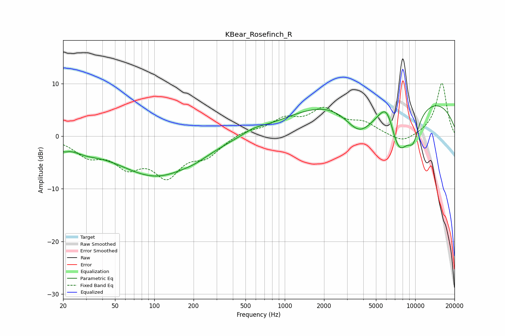

# KBear_Rosefinch_R
See [usage instructions](https://github.com/jaakkopasanen/AutoEq#usage) for more options and info.

### Parametric EQs
Apply preamp of -5.9 dB when using parametric equalizer.

|   # | Type    |   Fc (Hz) |    Q |   Gain (dB) |
|-----|---------|-----------|------|-------------|
|   1 | Peaking |        20 | 4.16 |        -1.1 |
|   2 | Peaking |        29 | 1.35 |        -1.2 |
|   3 | Peaking |       103 | 0.46 |        -7.5 |
|   4 | Peaking |       206 | 1.61 |        -0.5 |
|   5 | Peaking |       573 | 1.67 |         0.8 |
|   6 | Peaking |      3746 | 1.13 |        -6.9 |
|   7 | Peaking |      6085 | 2.19 |         5.3 |
|   8 | Peaking |      6726 | 0.25 |        17.1 |
|   9 | Peaking |      7444 | 0.87 |       -18.9 |
|  10 | Peaking |      9671 | 2.95 |        -4   |

### Fixed Band EQs
When using fixed band (also called graphic) equalizer, apply preamp of **-10.2 dB** (if available) and set gains manually with these parameters.

|   # | Type    |   Fc (Hz) |    Q |   Gain (dB) |
|-----|---------|-----------|------|-------------|
|   1 | Peaking |        31 | 1.41 |        -3.2 |
|   2 | Peaking |        62 | 1.41 |        -4.8 |
|   3 | Peaking |       125 | 1.41 |        -6.8 |
|   4 | Peaking |       250 | 1.41 |        -3.2 |
|   5 | Peaking |       500 | 1.41 |         1   |
|   6 | Peaking |      1000 | 1.41 |         2.9 |
|   7 | Peaking |      2000 | 1.41 |         4.6 |
|   8 | Peaking |      4000 | 1.41 |         2.1 |
|   9 | Peaking |      8000 | 1.41 |        -1.6 |
|  10 | Peaking |     16000 | 1.41 |        10.2 |

### Graphs

