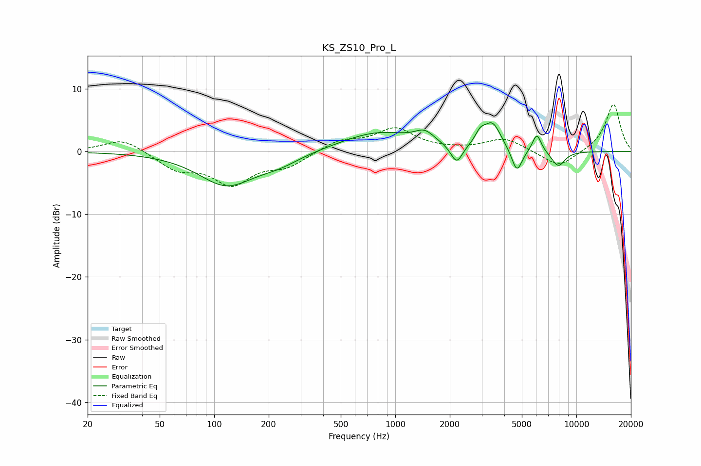

# KS_ZS10_Pro_L
See [usage instructions](https://github.com/jaakkopasanen/AutoEq#usage) for more options and info.

### Parametric EQs
Apply preamp of -4.7 dB when using parametric equalizer.

|   # | Type    |   Fc (Hz) |    Q |   Gain (dB) |
|-----|---------|-----------|------|-------------|
|   1 | Peaking |       117 | 0.92 |        -5.2 |
|   2 | Peaking |       228 | 1.19 |        -1.4 |
|   3 | Peaking |       808 | 0.68 |         3.1 |
|   4 | Peaking |      1452 | 2.67 |         1.8 |
|   5 | Peaking |      2182 | 4.3  |        -3.1 |
|   6 | Peaking |      2946 | 5.04 |         1.7 |
|   7 | Peaking |      3441 | 2.97 |         4.2 |
|   8 | Peaking |      4693 | 4.73 |        -3.9 |
|   9 | Peaking |      6049 | 5.57 |         3   |
|  10 | Peaking |      7938 | 3.53 |        -2.5 |

### Fixed Band EQs
When using fixed band (also called graphic) equalizer, apply preamp of **-7.6 dB** (if available) and set gains manually with these parameters.

|   # | Type    |   Fc (Hz) |    Q |   Gain (dB) |
|-----|---------|-----------|------|-------------|
|   1 | Peaking |        31 | 1.41 |         2.2 |
|   2 | Peaking |        62 | 1.41 |        -2.6 |
|   3 | Peaking |       125 | 1.41 |        -4.9 |
|   4 | Peaking |       250 | 1.41 |        -2.1 |
|   5 | Peaking |       500 | 1.41 |         1.7 |
|   6 | Peaking |      1000 | 1.41 |         3.5 |
|   7 | Peaking |      2000 | 1.41 |         0.1 |
|   8 | Peaking |      4000 | 1.41 |         2.1 |
|   9 | Peaking |      8000 | 1.41 |        -2.6 |
|  10 | Peaking |     16000 | 1.41 |         7.6 |

### Graphs

