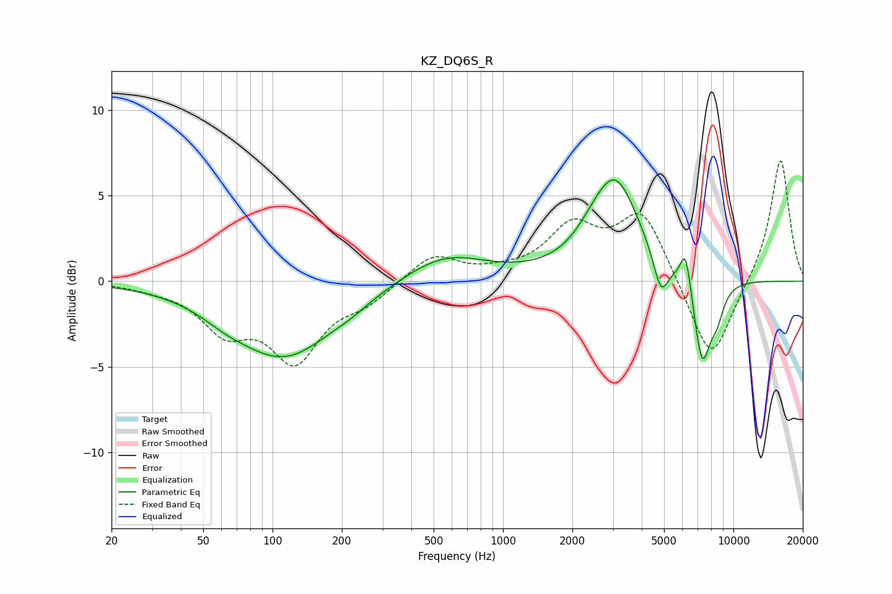

# KZ_DQ6S_R
See [usage instructions](https://github.com/jaakkopasanen/AutoEq#usage) for more options and info.

### Parametric EQs
Apply preamp of -6.0 dB when using parametric equalizer.

|   # | Type    |   Fc (Hz) |    Q |   Gain (dB) |
|-----|---------|-----------|------|-------------|
|   1 | Peaking |        62 | 1.49 |        -0.4 |
|   2 | Peaking |       112 | 0.64 |        -4.4 |
|   3 | Peaking |       220 | 1.87 |        -0.2 |
|   4 | Peaking |       559 | 0.78 |         1.6 |
|   5 | Peaking |      2392 | 2.27 |         0.4 |
|   6 | Peaking |      3059 | 1.34 |         5.9 |
|   7 | Peaking |      4846 | 4.34 |        -2.2 |
|   8 | Peaking |      6201 | 5.98 |         2.3 |
|   9 | Peaking |      7317 | 3.65 |        -4.9 |
|  10 | Peaking |      8462 | 4.17 |        -1.5 |

### Fixed Band EQs
When using fixed band (also called graphic) equalizer, apply preamp of **-7.1 dB** (if available) and set gains manually with these parameters.

|   # | Type    |   Fc (Hz) |    Q |   Gain (dB) |
|-----|---------|-----------|------|-------------|
|   1 | Peaking |        31 | 1.41 |        -0.2 |
|   2 | Peaking |        62 | 1.41 |        -2.6 |
|   3 | Peaking |       125 | 1.41 |        -4.3 |
|   4 | Peaking |       250 | 1.41 |        -1   |
|   5 | Peaking |       500 | 1.41 |         1.6 |
|   6 | Peaking |      1000 | 1.41 |         0.3 |
|   7 | Peaking |      2000 | 1.41 |         2.9 |
|   8 | Peaking |      4000 | 1.41 |         4   |
|   9 | Peaking |      8000 | 1.41 |        -5   |
|  10 | Peaking |     16000 | 1.41 |         7.3 |

### Graphs

