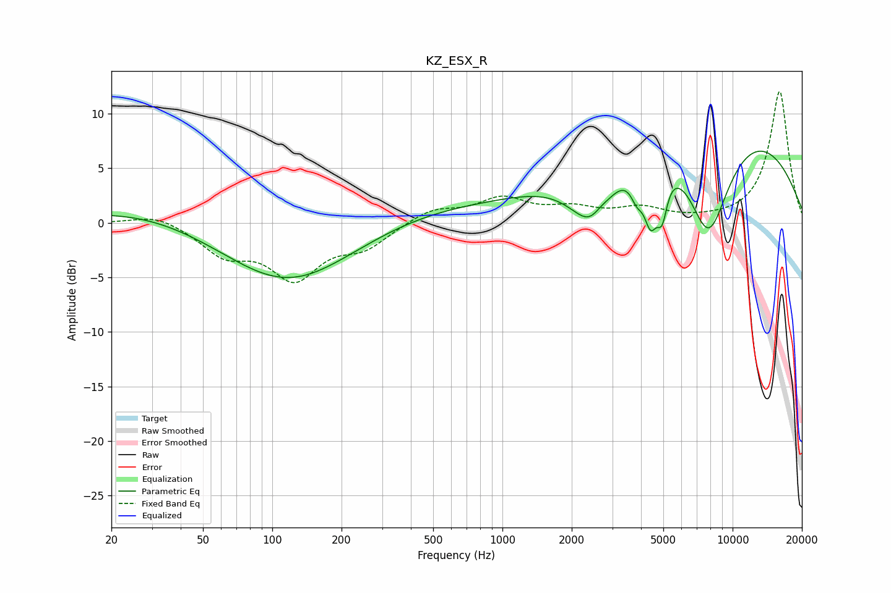

# KZ_ESX_R
See [usage instructions](https://github.com/jaakkopasanen/AutoEq#usage) for more options and info.

### Parametric EQs
Apply preamp of -6.7 dB when using parametric equalizer.

|   # | Type    |   Fc (Hz) |    Q |   Gain (dB) |
|-----|---------|-----------|------|-------------|
|   1 | Peaking |       113 | 0.18 |         5.9 |
|   2 | Peaking |       117 | 0.37 |       -10.9 |
|   3 | Peaking |      2423 | 1.32 |        -4.8 |
|   4 | Peaking |      2569 | 2.35 |        -1.6 |
|   5 | Peaking |      2647 | 3.52 |         1.1 |
|   6 | Peaking |      3842 | 4.88 |        -2.1 |
|   7 | Peaking |      4406 | 4.69 |        -4.8 |
|   8 | Peaking |      4937 | 6    |        -3.7 |
|   9 | Peaking |      7422 | 0.27 |        12.1 |
|  10 | Peaking |      7855 | 1.22 |       -12   |

### Fixed Band EQs
When using fixed band (also called graphic) equalizer, apply preamp of **-12.1 dB** (if available) and set gains manually with these parameters.

|   # | Type    |   Fc (Hz) |    Q |   Gain (dB) |
|-----|---------|-----------|------|-------------|
|   1 | Peaking |        31 | 1.41 |         0.9 |
|   2 | Peaking |        62 | 1.41 |        -2.6 |
|   3 | Peaking |       125 | 1.41 |        -4.7 |
|   4 | Peaking |       250 | 1.41 |        -2   |
|   5 | Peaking |       500 | 1.41 |         1.3 |
|   6 | Peaking |      1000 | 1.41 |         2.1 |
|   7 | Peaking |      2000 | 1.41 |         1.1 |
|   8 | Peaking |      4000 | 1.41 |         1.2 |
|   9 | Peaking |      8000 | 1.41 |         0.1 |
|  10 | Peaking |     16000 | 1.41 |        12.1 |

### Graphs

