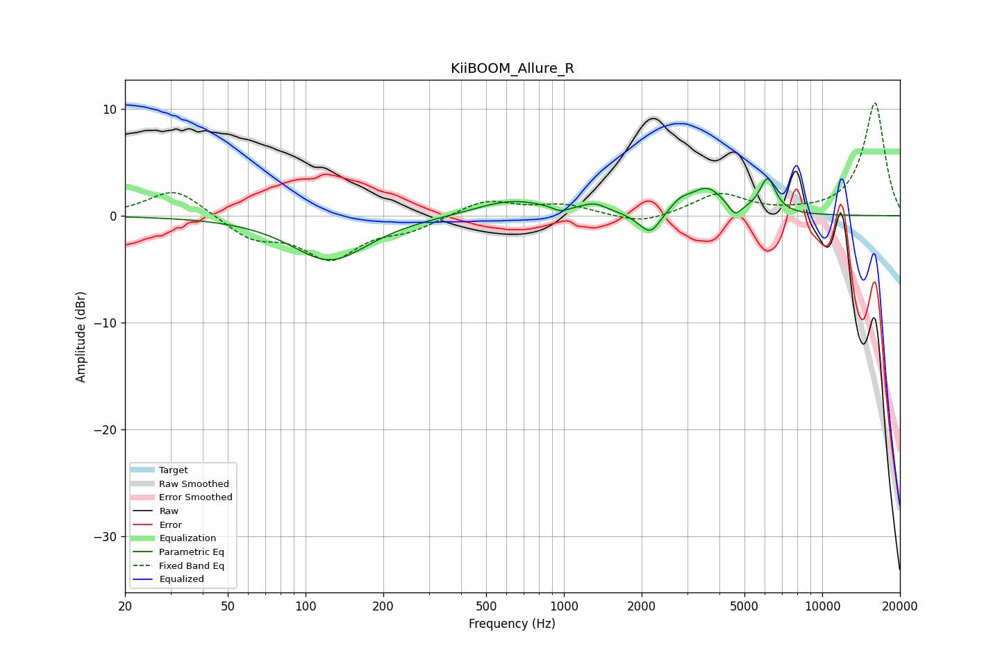

# KiiBOOM_Allure_R
See [usage instructions](https://github.com/jaakkopasanen/AutoEq#usage) for more options and info.

### Parametric EQs
Apply preamp of -3.6 dB when using parametric equalizer.

|   # | Type    |   Fc (Hz) |    Q |   Gain (dB) |
|-----|---------|-----------|------|-------------|
|   1 | Peaking |       124 | 0.96 |        -4.2 |
|   2 | Peaking |       627 | 1    |         1.5 |
|   3 | Peaking |       971 | 4.89 |        -0.5 |
|   4 | Peaking |      1313 | 2.81 |         0.8 |
|   5 | Peaking |      1992 | 3.05 |        -0.4 |
|   6 | Peaking |      2171 | 3.75 |        -1.8 |
|   7 | Peaking |      2823 | 3.71 |         0.8 |
|   8 | Peaking |      3582 | 2.13 |         2.5 |
|   9 | Peaking |      4587 | 5.53 |        -1.2 |
|  10 | Peaking |      6147 | 4.4  |         3.2 |

### Fixed Band EQs
When using fixed band (also called graphic) equalizer, apply preamp of **-10.6 dB** (if available) and set gains manually with these parameters.

|   # | Type    |   Fc (Hz) |    Q |   Gain (dB) |
|-----|---------|-----------|------|-------------|
|   1 | Peaking |        31 | 1.41 |         2.6 |
|   2 | Peaking |        62 | 1.41 |        -2   |
|   3 | Peaking |       125 | 1.41 |        -3.8 |
|   4 | Peaking |       250 | 1.41 |        -1.1 |
|   5 | Peaking |       500 | 1.41 |         1.5 |
|   6 | Peaking |      1000 | 1.41 |         1   |
|   7 | Peaking |      2000 | 1.41 |        -0.9 |
|   8 | Peaking |      4000 | 1.41 |         2   |
|   9 | Peaking |      8000 | 1.41 |         0.1 |
|  10 | Peaking |     16000 | 1.41 |        10.6 |

### Graphs

