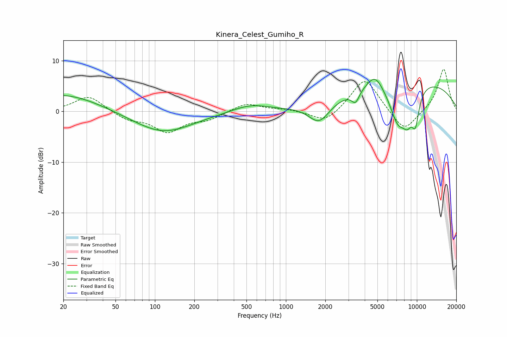

# Kinera_Celest_Gumiho_R
See [usage instructions](https://github.com/jaakkopasanen/AutoEq#usage) for more options and info.

### Parametric EQs
Apply preamp of -6.4 dB when using parametric equalizer.

|   # | Type    |   Fc (Hz) |    Q |   Gain (dB) |
|-----|---------|-----------|------|-------------|
|   1 | Peaking |        20 | 0.51 |         3.4 |
|   2 | Peaking |       115 | 0.62 |        -4.3 |
|   3 | Peaking |       533 | 1.03 |         1.4 |
|   4 | Peaking |      1793 | 1.78 |        -4   |
|   5 | Peaking |      3399 | 4.89 |        -2.2 |
|   6 | Peaking |      4793 | 2.19 |         3.3 |
|   7 | Peaking |      7175 | 1.93 |        -7.7 |
|   8 | Peaking |      8475 | 3.33 |        -4   |
|   9 | Peaking |      8869 | 0.26 |         6.5 |
|  10 | Peaking |      9741 | 4.18 |        -6   |

### Fixed Band EQs
When using fixed band (also called graphic) equalizer, apply preamp of **-8.4 dB** (if available) and set gains manually with these parameters.

|   # | Type    |   Fc (Hz) |    Q |   Gain (dB) |
|-----|---------|-----------|------|-------------|
|   1 | Peaking |        31 | 1.41 |         3.1 |
|   2 | Peaking |        62 | 1.41 |        -1.5 |
|   3 | Peaking |       125 | 1.41 |        -3.8 |
|   4 | Peaking |       250 | 1.41 |        -1.4 |
|   5 | Peaking |       500 | 1.41 |         1.7 |
|   6 | Peaking |      1000 | 1.41 |         0.4 |
|   7 | Peaking |      2000 | 1.41 |        -2.5 |
|   8 | Peaking |      4000 | 1.41 |         6.8 |
|   9 | Peaking |      8000 | 1.41 |        -4.4 |
|  10 | Peaking |     16000 | 1.41 |         8.5 |

### Graphs

