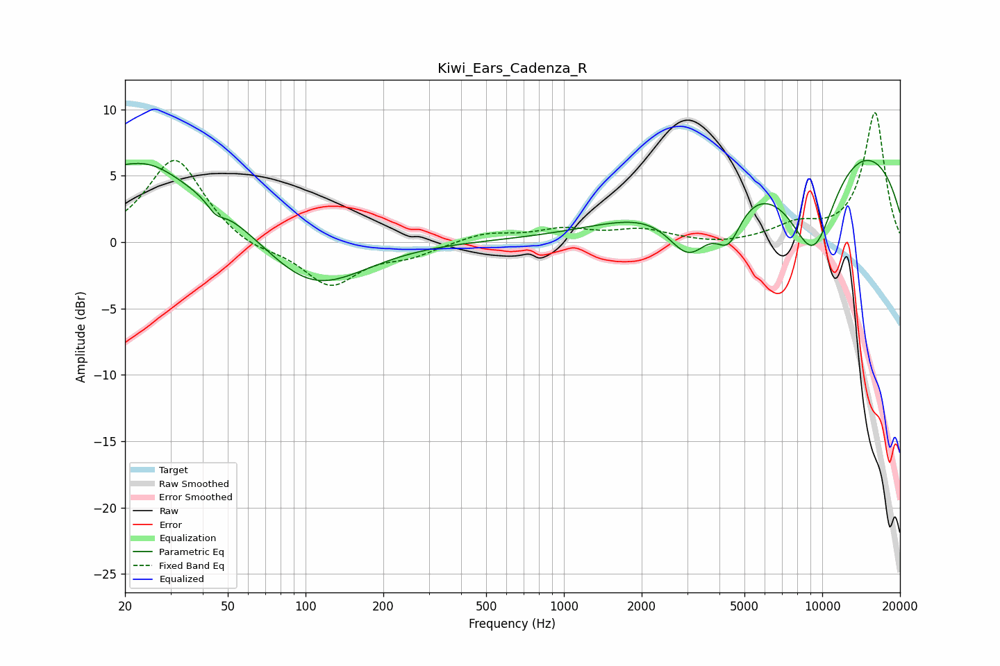

# Kiwi_Ears_Cadenza_R
See [usage instructions](https://github.com/jaakkopasanen/AutoEq#usage) for more options and info.

### Parametric EQs
Apply preamp of -6.3 dB when using parametric equalizer.

|   # | Type    |   Fc (Hz) |    Q |   Gain (dB) |
|-----|---------|-----------|------|-------------|
|   1 | Peaking |        23 | 0.25 |         5.8 |
|   2 | Peaking |        25 | 1.4  |         1   |
|   3 | Peaking |        45 | 5.2  |        -2.4 |
|   4 | Peaking |        45 | 5.58 |         1.7 |
|   5 | Peaking |       104 | 0.59 |        -7.1 |
|   6 | Peaking |       134 | 0.45 |         1.7 |
|   7 | Peaking |      3055 | 1.63 |        -4.4 |
|   8 | Peaking |      4340 | 2.71 |        -3.2 |
|   9 | Peaking |      9239 | 0.82 |       -15.8 |
|  10 | Peaking |      9804 | 0.33 |        15.9 |

### Fixed Band EQs
When using fixed band (also called graphic) equalizer, apply preamp of **-9.9 dB** (if available) and set gains manually with these parameters.

|   # | Type    |   Fc (Hz) |    Q |   Gain (dB) |
|-----|---------|-----------|------|-------------|
|   1 | Peaking |        31 | 1.41 |         6.4 |
|   2 | Peaking |        62 | 1.41 |        -0.7 |
|   3 | Peaking |       125 | 1.41 |        -3.2 |
|   4 | Peaking |       250 | 1.41 |        -0.9 |
|   5 | Peaking |       500 | 1.41 |         0.7 |
|   6 | Peaking |      1000 | 1.41 |         0.9 |
|   7 | Peaking |      2000 | 1.41 |         0.9 |
|   8 | Peaking |      4000 | 1.41 |        -0.2 |
|   9 | Peaking |      8000 | 1.41 |         1.2 |
|  10 | Peaking |     16000 | 1.41 |         9.8 |

### Graphs

