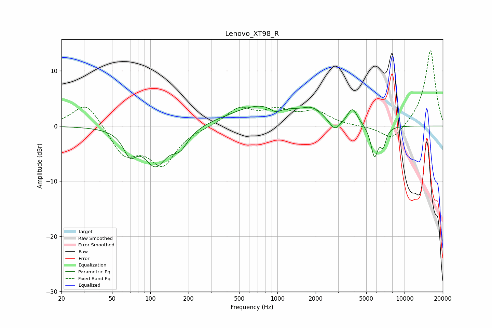

# Lenovo_XT98_R
See [usage instructions](https://github.com/jaakkopasanen/AutoEq#usage) for more options and info.

### Parametric EQs
Apply preamp of -3.7 dB when using parametric equalizer.

|   # | Type    |   Fc (Hz) |    Q |   Gain (dB) |
|-----|---------|-----------|------|-------------|
|   1 | Peaking |        69 | 2.81 |        -3.8 |
|   2 | Peaking |       110 | 1.61 |        -6.6 |
|   3 | Peaking |       171 | 2.21 |        -3   |
|   4 | Peaking |       788 | 0.55 |         3.9 |
|   5 | Peaking |       968 | 3.05 |        -1.3 |
|   6 | Peaking |      1895 | 1.83 |         1.8 |
|   7 | Peaking |      2826 | 3.4  |        -2   |
|   8 | Peaking |      3898 | 3.62 |         3   |
|   9 | Peaking |      5794 | 4.91 |        -5.5 |
|  10 | Peaking |      6802 | 5.93 |        -3   |

### Fixed Band EQs
When using fixed band (also called graphic) equalizer, apply preamp of **-13.7 dB** (if available) and set gains manually with these parameters.

|   # | Type    |   Fc (Hz) |    Q |   Gain (dB) |
|-----|---------|-----------|------|-------------|
|   1 | Peaking |        31 | 1.41 |         4.6 |
|   2 | Peaking |        62 | 1.41 |        -5.1 |
|   3 | Peaking |       125 | 1.41 |        -6.7 |
|   4 | Peaking |       250 | 1.41 |        -0.1 |
|   5 | Peaking |       500 | 1.41 |         3.1 |
|   6 | Peaking |      1000 | 1.41 |         2.5 |
|   7 | Peaking |      2000 | 1.41 |         2.4 |
|   8 | Peaking |      4000 | 1.41 |        -0.1 |
|   9 | Peaking |      8000 | 1.41 |        -2.9 |
|  10 | Peaking |     16000 | 1.41 |        13.9 |

### Graphs

