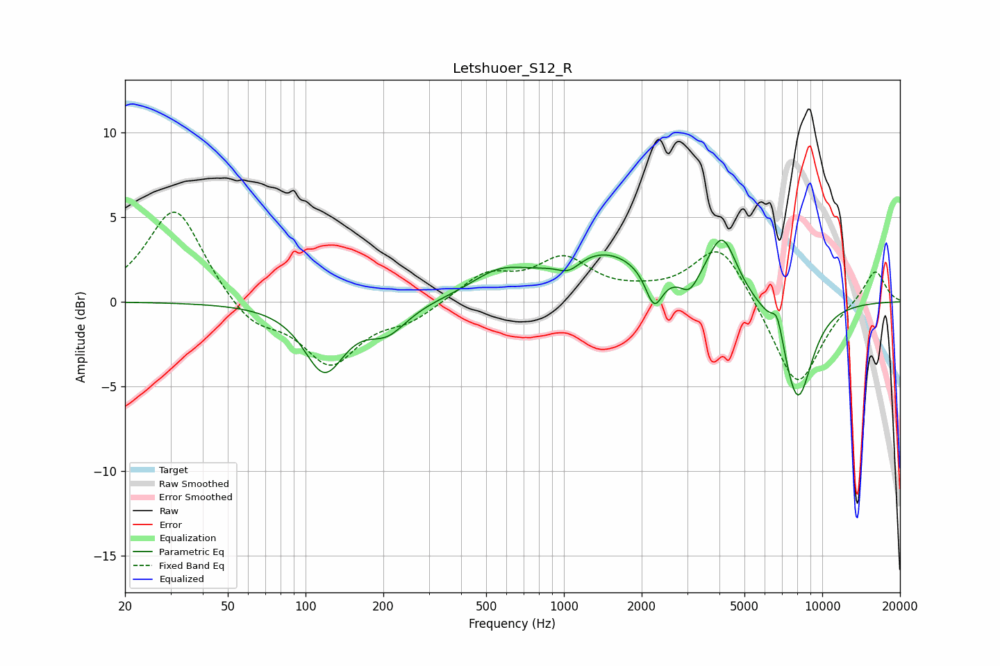

# Letshuoer_S12_R
See [usage instructions](https://github.com/jaakkopasanen/AutoEq#usage) for more options and info.

### Parametric EQs
Apply preamp of -3.7 dB when using parametric equalizer.

|   # | Type    |   Fc (Hz) |    Q |   Gain (dB) |
|-----|---------|-----------|------|-------------|
|   1 | Peaking |       118 | 1.82 |        -4   |
|   2 | Peaking |       207 | 1.81 |        -1.6 |
|   3 | Peaking |       558 | 1.31 |         1.3 |
|   4 | Peaking |      1045 | 3.02 |        -0.8 |
|   5 | Peaking |      1418 | 0.73 |         2.9 |
|   6 | Peaking |      2234 | 4.3  |        -2.2 |
|   7 | Peaking |      3065 | 4.08 |        -1   |
|   8 | Peaking |      4102 | 2.48 |         3.6 |
|   9 | Peaking |      6706 | 6    |         1.5 |
|  10 | Peaking |      8024 | 2.25 |        -6   |

### Fixed Band EQs
When using fixed band (also called graphic) equalizer, apply preamp of **-5.4 dB** (if available) and set gains manually with these parameters.

|   # | Type    |   Fc (Hz) |    Q |   Gain (dB) |
|-----|---------|-----------|------|-------------|
|   1 | Peaking |        31 | 1.41 |         5.7 |
|   2 | Peaking |        62 | 1.41 |        -1.5 |
|   3 | Peaking |       125 | 1.41 |        -3.6 |
|   4 | Peaking |       250 | 1.41 |        -1   |
|   5 | Peaking |       500 | 1.41 |         1.6 |
|   6 | Peaking |      1000 | 1.41 |         2.4 |
|   7 | Peaking |      2000 | 1.41 |         0.3 |
|   8 | Peaking |      4000 | 1.41 |         3.5 |
|   9 | Peaking |      8000 | 1.41 |        -5.2 |
|  10 | Peaking |     16000 | 1.41 |         2   |

### Graphs

