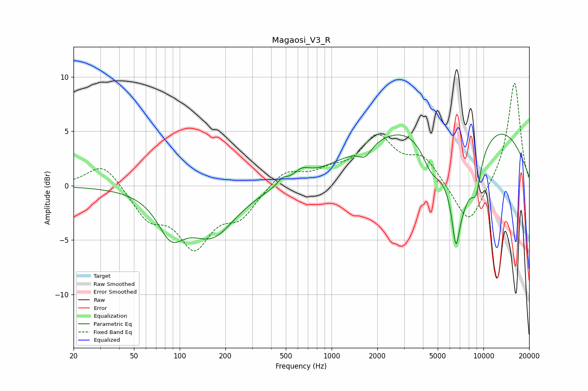

# Magaosi_V3_R
See [usage instructions](https://github.com/jaakkopasanen/AutoEq#usage) for more options and info.

### Parametric EQs
Apply preamp of -4.8 dB when using parametric equalizer.

|   # | Type    |   Fc (Hz) |    Q |   Gain (dB) |
|-----|---------|-----------|------|-------------|
|   1 | Peaking |        87 | 1.65 |        -3.4 |
|   2 | Peaking |       163 | 0.91 |        -4.3 |
|   3 | Peaking |       473 | 4.61 |         0.6 |
|   4 | Peaking |       636 | 2.75 |         0.9 |
|   5 | Peaking |      1661 | 3.23 |        -1.1 |
|   6 | Peaking |      4535 | 2.15 |        -2.5 |
|   7 | Peaking |      6584 | 5.9  |        -4   |
|   8 | Peaking |      6682 | 0.23 |         8.1 |
|   9 | Peaking |      6994 | 1.15 |        -8.8 |
|  10 | Peaking |      8943 | 4.33 |        -2.6 |

### Fixed Band EQs
When using fixed band (also called graphic) equalizer, apply preamp of **-9.5 dB** (if available) and set gains manually with these parameters.

|   # | Type    |   Fc (Hz) |    Q |   Gain (dB) |
|-----|---------|-----------|------|-------------|
|   1 | Peaking |        31 | 1.41 |         2.2 |
|   2 | Peaking |        62 | 1.41 |        -2.7 |
|   3 | Peaking |       125 | 1.41 |        -5.2 |
|   4 | Peaking |       250 | 1.41 |        -2.5 |
|   5 | Peaking |       500 | 1.41 |         1.5 |
|   6 | Peaking |      1000 | 1.41 |         1   |
|   7 | Peaking |      2000 | 1.41 |         4.2 |
|   8 | Peaking |      4000 | 1.41 |         2.4 |
|   9 | Peaking |      8000 | 1.41 |        -3.9 |
|  10 | Peaking |     16000 | 1.41 |         9.6 |

### Graphs

