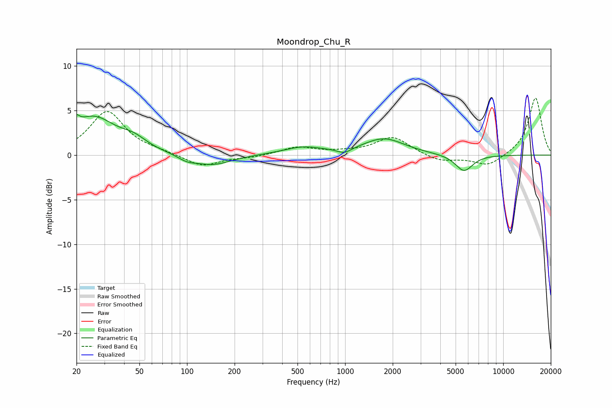

# Moondrop_Chu_R
See [usage instructions](https://github.com/jaakkopasanen/AutoEq#usage) for more options and info.

### Parametric EQs
Apply preamp of -4.6 dB when using parametric equalizer.

|   # | Type    |   Fc (Hz) |    Q |   Gain (dB) |
|-----|---------|-----------|------|-------------|
|   1 | Peaking |        20 | 5.89 |         3.3 |
|   2 | Peaking |        20 | 5.9  |        -2.1 |
|   3 | Peaking |        26 | 1.01 |         4.1 |
|   4 | Peaking |        46 | 1.72 |         1.1 |
|   5 | Peaking |       100 | 2.45 |        -0.5 |
|   6 | Peaking |       145 | 1.21 |        -1.2 |
|   7 | Peaking |       541 | 1.13 |         0.8 |
|   8 | Peaking |       989 | 3.21 |        -0.6 |
|   9 | Peaking |      1762 | 1.09 |         1.8 |
|  10 | Peaking |      5650 | 2.52 |        -1.9 |

### Fixed Band EQs
When using fixed band (also called graphic) equalizer, apply preamp of **-6.5 dB** (if available) and set gains manually with these parameters.

|   # | Type    |   Fc (Hz) |    Q |   Gain (dB) |
|-----|---------|-----------|------|-------------|
|   1 | Peaking |        31 | 1.41 |         4.9 |
|   2 | Peaking |        62 | 1.41 |         0.3 |
|   3 | Peaking |       125 | 1.41 |        -1.3 |
|   4 | Peaking |       250 | 1.41 |        -0.2 |
|   5 | Peaking |       500 | 1.41 |         0.9 |
|   6 | Peaking |      1000 | 1.41 |         0.2 |
|   7 | Peaking |      2000 | 1.41 |         2   |
|   8 | Peaking |      4000 | 1.41 |        -0.8 |
|   9 | Peaking |      8000 | 1.41 |        -1.3 |
|  10 | Peaking |     16000 | 1.41 |         6.5 |

### Graphs

