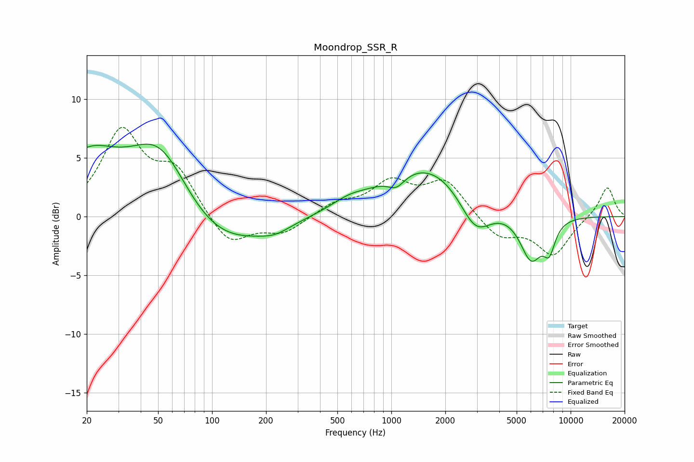

# Moondrop_SSR_R
See [usage instructions](https://github.com/jaakkopasanen/AutoEq#usage) for more options and info.

### Parametric EQs
Apply preamp of -6.3 dB when using parametric equalizer.

|   # | Type    |   Fc (Hz) |    Q |   Gain (dB) |
|-----|---------|-----------|------|-------------|
|   1 | Peaking |        20 | 0.83 |         4.5 |
|   2 | Peaking |        52 | 0.77 |         7.6 |
|   3 | Peaking |        95 | 0.51 |        -4.1 |
|   4 | Peaking |       224 | 1.74 |        -0.6 |
|   5 | Peaking |       575 | 1.63 |         0.5 |
|   6 | Peaking |      1068 | 2.96 |        -1.1 |
|   7 | Peaking |      1604 | 0.52 |         4.6 |
|   8 | Peaking |      2943 | 1.53 |        -3.5 |
|   9 | Peaking |      6018 | 2.18 |        -3.9 |
|  10 | Peaking |      7607 | 4.05 |        -2.2 |

### Fixed Band EQs
When using fixed band (also called graphic) equalizer, apply preamp of **-7.7 dB** (if available) and set gains manually with these parameters.

|   # | Type    |   Fc (Hz) |    Q |   Gain (dB) |
|-----|---------|-----------|------|-------------|
|   1 | Peaking |        31 | 1.41 |         7   |
|   2 | Peaking |        62 | 1.41 |         3.6 |
|   3 | Peaking |       125 | 1.41 |        -2.6 |
|   4 | Peaking |       250 | 1.41 |        -1.4 |
|   5 | Peaking |       500 | 1.41 |         1.1 |
|   6 | Peaking |      1000 | 1.41 |         2.7 |
|   7 | Peaking |      2000 | 1.41 |         2.9 |
|   8 | Peaking |      4000 | 1.41 |        -1.8 |
|   9 | Peaking |      8000 | 1.41 |        -3.2 |
|  10 | Peaking |     16000 | 1.41 |         2.6 |

### Graphs

