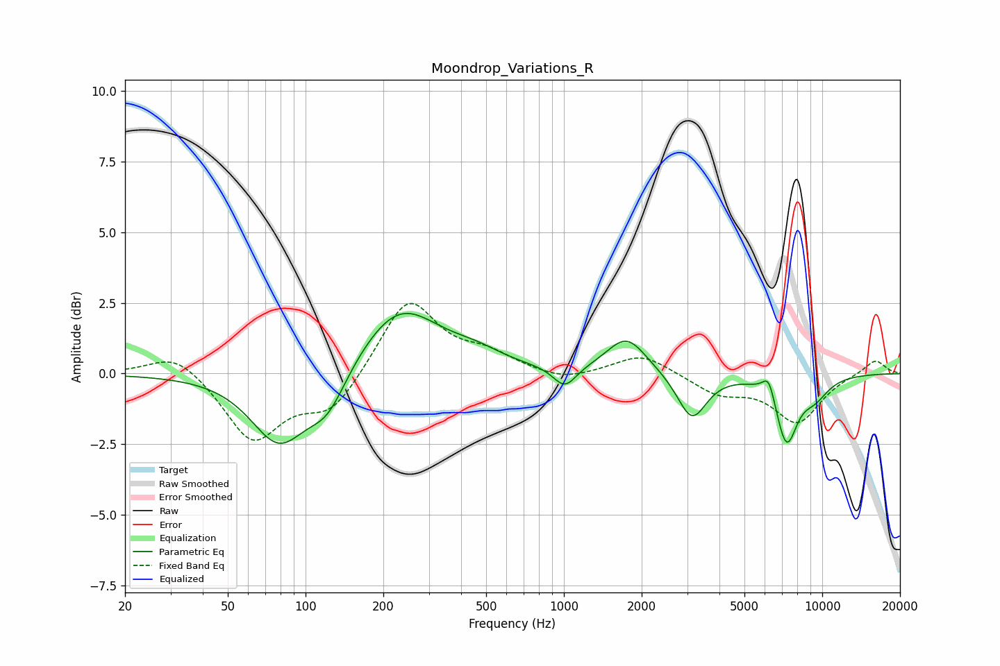

# Moondrop_Variations_R
See [usage instructions](https://github.com/jaakkopasanen/AutoEq#usage) for more options and info.

### Parametric EQs
Apply preamp of -2.2 dB when using parametric equalizer.

|   # | Type    |   Fc (Hz) |    Q |   Gain (dB) |
|-----|---------|-----------|------|-------------|
|   1 | Peaking |        79 | 1.3  |        -2.5 |
|   2 | Peaking |       122 | 1.9  |        -1.3 |
|   3 | Peaking |       231 | 0.92 |         2.4 |
|   4 | Peaking |       458 | 1.37 |         0.4 |
|   5 | Peaking |      1008 | 3.18 |        -0.8 |
|   6 | Peaking |      1749 | 1.84 |         1.3 |
|   7 | Peaking |      3130 | 2.52 |        -1.6 |
|   8 | Peaking |      6209 | 5.7  |         0.8 |
|   9 | Peaking |      7271 | 3.22 |        -2.3 |
|  10 | Peaking |      9331 | 2.2  |        -0.7 |

### Fixed Band EQs
When using fixed band (also called graphic) equalizer, apply preamp of **-2.6 dB** (if available) and set gains manually with these parameters.

|   # | Type    |   Fc (Hz) |    Q |   Gain (dB) |
|-----|---------|-----------|------|-------------|
|   1 | Peaking |        31 | 1.41 |         0.8 |
|   2 | Peaking |        62 | 1.41 |        -2.4 |
|   3 | Peaking |       125 | 1.41 |        -1.3 |
|   4 | Peaking |       250 | 1.41 |         2.7 |
|   5 | Peaking |       500 | 1.41 |         0.6 |
|   6 | Peaking |      1000 | 1.41 |        -0.3 |
|   7 | Peaking |      2000 | 1.41 |         0.7 |
|   8 | Peaking |      4000 | 1.41 |        -0.7 |
|   9 | Peaking |      8000 | 1.41 |        -1.7 |
|  10 | Peaking |     16000 | 1.41 |         0.5 |

### Graphs

