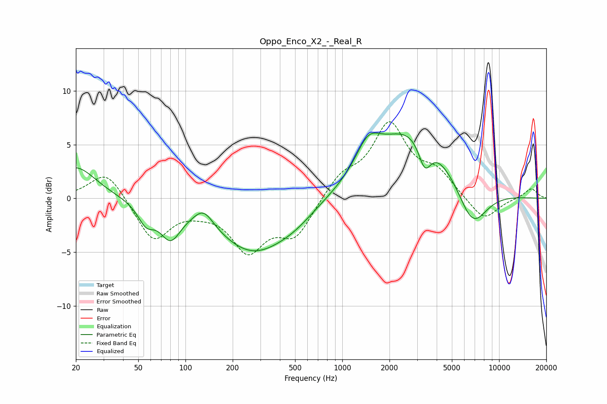

# Oppo_Enco_X2_-_Real_R
See [usage instructions](https://github.com/jaakkopasanen/AutoEq#usage) for more options and info.

### Parametric EQs
Apply preamp of -6.2 dB when using parametric equalizer.

|   # | Type    |   Fc (Hz) |    Q |   Gain (dB) |
|-----|---------|-----------|------|-------------|
|   1 | Peaking |        20 | 1.13 |         3   |
|   2 | Peaking |        56 | 2.71 |        -1.8 |
|   3 | Peaking |        80 | 2.18 |        -2.9 |
|   4 | Peaking |       130 | 2.27 |         1.6 |
|   5 | Peaking |       270 | 0.61 |        -4.9 |
|   6 | Peaking |       496 | 1.11 |        -0.8 |
|   7 | Peaking |      1460 | 1.81 |         2.7 |
|   8 | Peaking |      2822 | 0.58 |         6.5 |
|   9 | Peaking |      3358 | 3.43 |        -2.8 |
|  10 | Peaking |      6731 | 1.4  |        -4.3 |

### Fixed Band EQs
When using fixed band (also called graphic) equalizer, apply preamp of **-7.2 dB** (if available) and set gains manually with these parameters.

|   # | Type    |   Fc (Hz) |    Q |   Gain (dB) |
|-----|---------|-----------|------|-------------|
|   1 | Peaking |        31 | 1.41 |         2.7 |
|   2 | Peaking |        62 | 1.41 |        -3.9 |
|   3 | Peaking |       125 | 1.41 |        -0.6 |
|   4 | Peaking |       250 | 1.41 |        -4.5 |
|   5 | Peaking |       500 | 1.41 |        -3.3 |
|   6 | Peaking |      1000 | 1.41 |         1.9 |
|   7 | Peaking |      2000 | 1.41 |         6.6 |
|   8 | Peaking |      4000 | 1.41 |         2.1 |
|   9 | Peaking |      8000 | 1.41 |        -2.2 |
|  10 | Peaking |     16000 | 1.41 |         0.9 |

### Graphs

