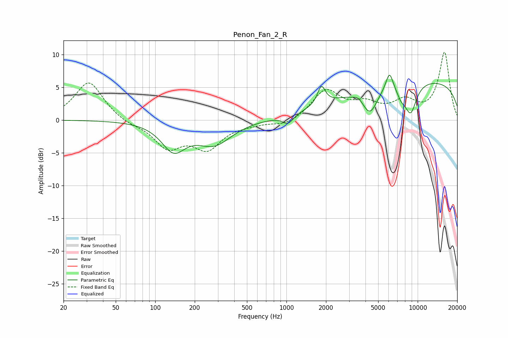

# Penon_Fan_2_R
See [usage instructions](https://github.com/jaakkopasanen/AutoEq#usage) for more options and info.

### Parametric EQs
Apply preamp of -6.9 dB when using parametric equalizer.

|   # | Type    |   Fc (Hz) |    Q |   Gain (dB) |
|-----|---------|-----------|------|-------------|
|   1 | Peaking |       138 | 1.56 |        -4.2 |
|   2 | Peaking |       282 | 1.07 |        -3.5 |
|   3 | Peaking |      1028 | 3.44 |        -1.4 |
|   4 | Peaking |      1846 | 4.79 |         2.8 |
|   5 | Peaking |      3541 | 4.56 |         0.5 |
|   6 | Peaking |      4327 | 2.42 |        -3.8 |
|   7 | Peaking |      6095 | 4.93 |         2.9 |
|   8 | Peaking |      7489 | 3.78 |        -1.4 |
|   9 | Peaking |      8831 | 2.8  |        -4.6 |
|  10 | Peaking |     10000 | 0.18 |         6.1 |

### Fixed Band EQs
When using fixed band (also called graphic) equalizer, apply preamp of **-10.4 dB** (if available) and set gains manually with these parameters.

|   # | Type    |   Fc (Hz) |    Q |   Gain (dB) |
|-----|---------|-----------|------|-------------|
|   1 | Peaking |        31 | 1.41 |         5.9 |
|   2 | Peaking |        62 | 1.41 |        -0.6 |
|   3 | Peaking |       125 | 1.41 |        -4   |
|   4 | Peaking |       250 | 1.41 |        -4   |
|   5 | Peaking |       500 | 1.41 |        -0.4 |
|   6 | Peaking |      1000 | 1.41 |        -1   |
|   7 | Peaking |      2000 | 1.41 |         4.4 |
|   8 | Peaking |      4000 | 1.41 |         2   |
|   9 | Peaking |      8000 | 1.41 |         2.5 |
|  10 | Peaking |     16000 | 1.41 |        10.2 |

### Graphs

