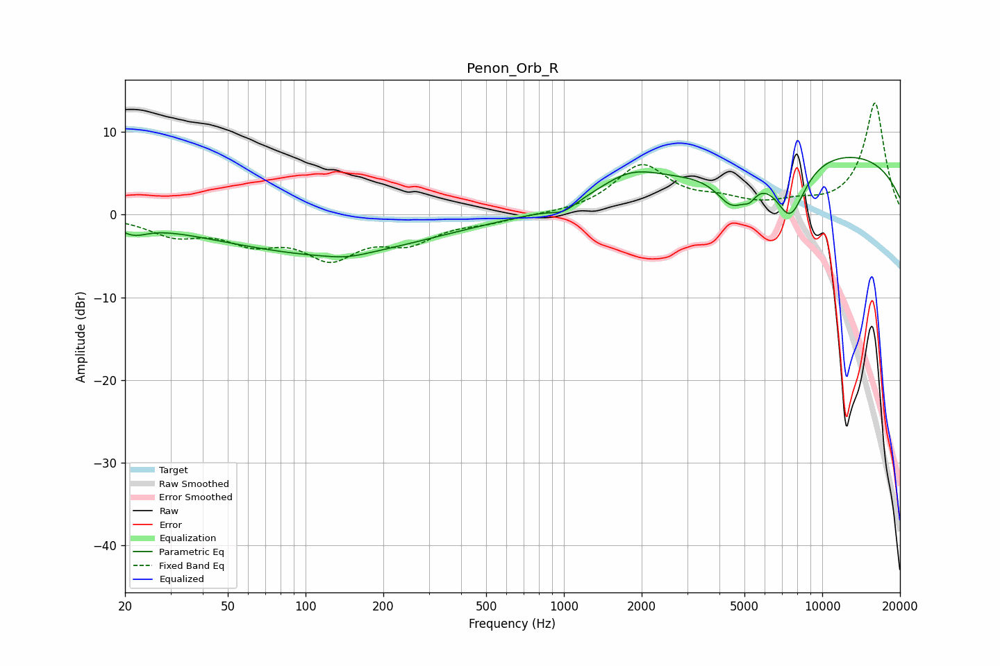

# Penon_Orb_R
See [usage instructions](https://github.com/jaakkopasanen/AutoEq#usage) for more options and info.

### Parametric EQs
Apply preamp of -7.0 dB when using parametric equalizer.

|   # | Type    |   Fc (Hz) |    Q |   Gain (dB) |
|-----|---------|-----------|------|-------------|
|   1 | Peaking |        21 | 2.6  |        -1.3 |
|   2 | Peaking |        68 | 0.93 |         0.2 |
|   3 | Peaking |       114 | 0.34 |        -4.8 |
|   4 | Peaking |       145 | 1.75 |        -0.5 |
|   5 | Peaking |       999 | 2.91 |        -1   |
|   6 | Peaking |      1792 | 1.12 |         3   |
|   7 | Peaking |      4482 | 2.23 |        -4.2 |
|   8 | Peaking |      5238 | 5.59 |        -1.2 |
|   9 | Peaking |      7512 | 2.17 |        -6.9 |
|  10 | Peaking |     10000 | 0.23 |         7.8 |

### Fixed Band EQs
When using fixed band (also called graphic) equalizer, apply preamp of **-13.6 dB** (if available) and set gains manually with these parameters.

|   # | Type    |   Fc (Hz) |    Q |   Gain (dB) |
|-----|---------|-----------|------|-------------|
|   1 | Peaking |        31 | 1.41 |        -2.2 |
|   2 | Peaking |        62 | 1.41 |        -2.7 |
|   3 | Peaking |       125 | 1.41 |        -4.7 |
|   4 | Peaking |       250 | 1.41 |        -2.9 |
|   5 | Peaking |       500 | 1.41 |        -0.7 |
|   6 | Peaking |      1000 | 1.41 |        -0   |
|   7 | Peaking |      2000 | 1.41 |         5.8 |
|   8 | Peaking |      4000 | 1.41 |         1.3 |
|   9 | Peaking |      8000 | 1.41 |         1   |
|  10 | Peaking |     16000 | 1.41 |        13.5 |

### Graphs

