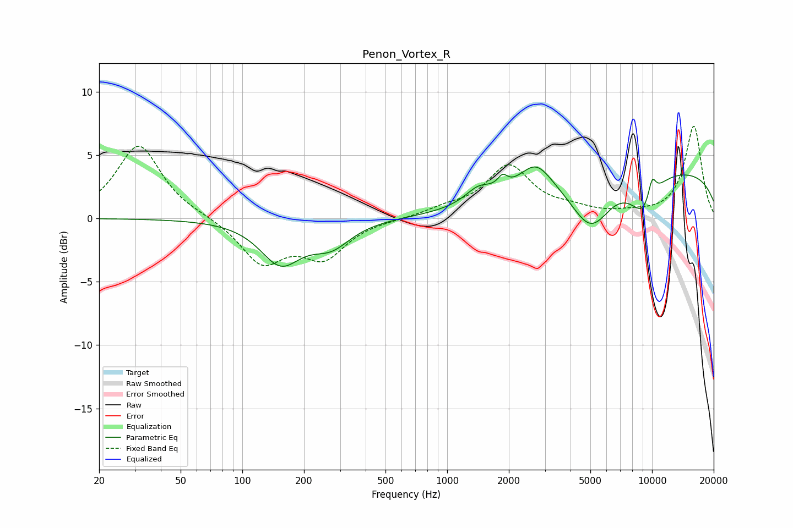

# Penon_Vortex_R
See [usage instructions](https://github.com/jaakkopasanen/AutoEq#usage) for more options and info.

### Parametric EQs
Apply preamp of -4.2 dB when using parametric equalizer.

|   # | Type    |   Fc (Hz) |    Q |   Gain (dB) |
|-----|---------|-----------|------|-------------|
|   1 | Peaking |       154 | 1.43 |        -3.3 |
|   2 | Peaking |       271 | 1.46 |        -1.8 |
|   3 | Peaking |      1423 | 2.18 |         1.2 |
|   4 | Peaking |      1863 | 5.98 |         0.9 |
|   5 | Peaking |      2705 | 1.79 |         2.3 |
|   6 | Peaking |      5020 | 1.41 |        -4   |
|   7 | Peaking |      6559 | 6    |         0   |
|   8 | Peaking |      9093 | 1.96 |        -2.8 |
|   9 | Peaking |     10000 | 0.18 |         4   |
|  10 | Peaking |     10000 | 5.93 |         1.7 |

### Fixed Band EQs
When using fixed band (also called graphic) equalizer, apply preamp of **-7.4 dB** (if available) and set gains manually with these parameters.

|   # | Type    |   Fc (Hz) |    Q |   Gain (dB) |
|-----|---------|-----------|------|-------------|
|   1 | Peaking |        31 | 1.41 |         5.8 |
|   2 | Peaking |        62 | 1.41 |         0.1 |
|   3 | Peaking |       125 | 1.41 |        -3.4 |
|   4 | Peaking |       250 | 1.41 |        -2.9 |
|   5 | Peaking |       500 | 1.41 |        -0   |
|   6 | Peaking |      1000 | 1.41 |         0.6 |
|   7 | Peaking |      2000 | 1.41 |         4   |
|   8 | Peaking |      4000 | 1.41 |         0.5 |
|   9 | Peaking |      8000 | 1.41 |         0.3 |
|  10 | Peaking |     16000 | 1.41 |         7.3 |

### Graphs

