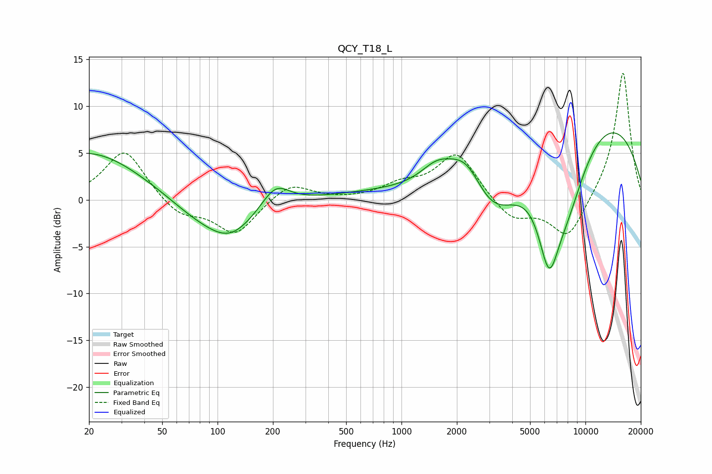

# QCY_T18_L
See [usage instructions](https://github.com/jaakkopasanen/AutoEq#usage) for more options and info.

### Parametric EQs
Apply preamp of -7.2 dB when using parametric equalizer.

|   # | Type    |   Fc (Hz) |    Q |   Gain (dB) |
|-----|---------|-----------|------|-------------|
|   1 | Peaking |        20 | 0.49 |         5.2 |
|   2 | Peaking |        77 | 0.82 |        -1.7 |
|   3 | Peaking |       118 | 1.04 |        -3.5 |
|   4 | Peaking |       207 | 1.87 |         2.4 |
|   5 | Peaking |      1556 | 1.56 |         2.2 |
|   6 | Peaking |      2275 | 1.27 |         5.8 |
|   7 | Peaking |      3003 | 0.48 |       -16.8 |
|   8 | Peaking |      5814 | 0.21 |        17   |
|   9 | Peaking |      6338 | 2.24 |        -9   |
|  10 | Peaking |      7914 | 1.02 |        -8.5 |

### Fixed Band EQs
When using fixed band (also called graphic) equalizer, apply preamp of **-13.6 dB** (if available) and set gains manually with these parameters.

|   # | Type    |   Fc (Hz) |    Q |   Gain (dB) |
|-----|---------|-----------|------|-------------|
|   1 | Peaking |        31 | 1.41 |         5.4 |
|   2 | Peaking |        62 | 1.41 |        -1.8 |
|   3 | Peaking |       125 | 1.41 |        -3.7 |
|   4 | Peaking |       250 | 1.41 |         1.9 |
|   5 | Peaking |       500 | 1.41 |        -0   |
|   6 | Peaking |      1000 | 1.41 |         1.4 |
|   7 | Peaking |      2000 | 1.41 |         5   |
|   8 | Peaking |      4000 | 1.41 |        -2.3 |
|   9 | Peaking |      8000 | 1.41 |        -4.3 |
|  10 | Peaking |     16000 | 1.41 |        13.8 |

### Graphs

