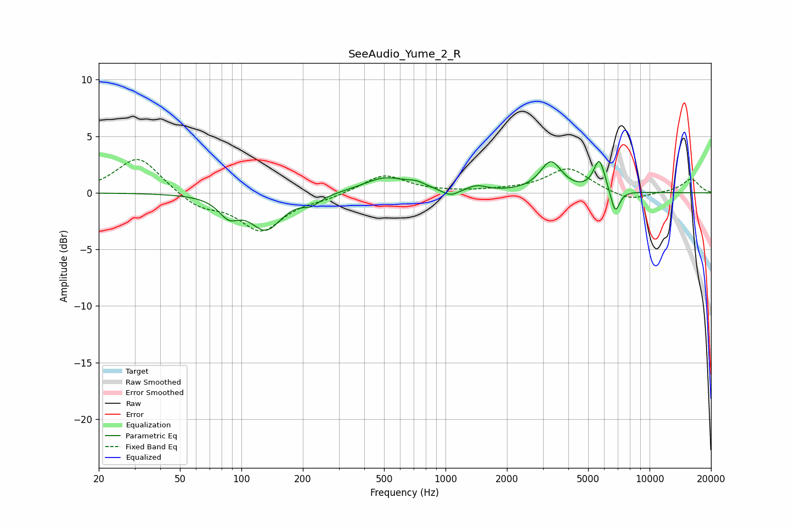

# SeeAudio_Yume_2_R
See [usage instructions](https://github.com/jaakkopasanen/AutoEq#usage) for more options and info.

### Parametric EQs
Apply preamp of -2.9 dB when using parametric equalizer.

|   # | Type    |   Fc (Hz) |    Q |   Gain (dB) |
|-----|---------|-----------|------|-------------|
|   1 | Peaking |        87 | 2.85 |        -1.6 |
|   2 | Peaking |       132 | 1.85 |        -3.1 |
|   3 | Peaking |       220 | 3.11 |        -0.7 |
|   4 | Peaking |       507 | 1.31 |         1.3 |
|   5 | Peaking |       724 | 3.24 |         0.4 |
|   6 | Peaking |      1058 | 3.58 |        -0.6 |
|   7 | Peaking |      1423 | 2.99 |         0.5 |
|   8 | Peaking |      3286 | 2.68 |         2.7 |
|   9 | Peaking |      5676 | 4.87 |         2.8 |
|  10 | Peaking |      6785 | 6    |        -2.1 |

### Fixed Band EQs
When using fixed band (also called graphic) equalizer, apply preamp of **-3.0 dB** (if available) and set gains manually with these parameters.

|   # | Type    |   Fc (Hz) |    Q |   Gain (dB) |
|-----|---------|-----------|------|-------------|
|   1 | Peaking |        31 | 1.41 |         3.3 |
|   2 | Peaking |        62 | 1.41 |        -1.2 |
|   3 | Peaking |       125 | 1.41 |        -3.2 |
|   4 | Peaking |       250 | 1.41 |        -0.4 |
|   5 | Peaking |       500 | 1.41 |         1.6 |
|   6 | Peaking |      1000 | 1.41 |         0   |
|   7 | Peaking |      2000 | 1.41 |         0.2 |
|   8 | Peaking |      4000 | 1.41 |         2.2 |
|   9 | Peaking |      8000 | 1.41 |        -0.8 |
|  10 | Peaking |     16000 | 1.41 |         1.2 |

### Graphs

