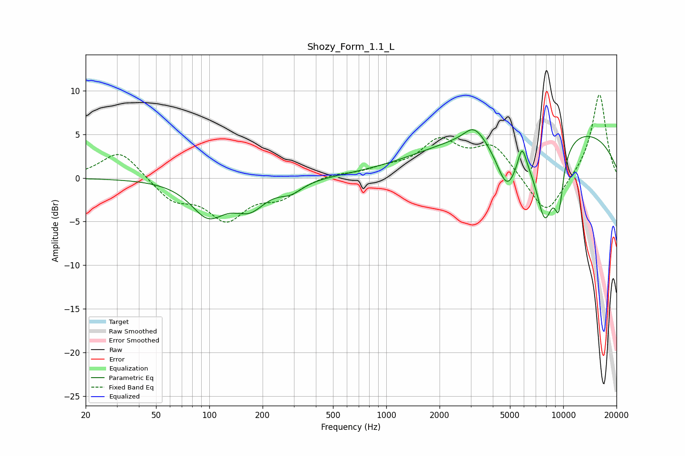

# Shozy_Form_1.1_L
See [usage instructions](https://github.com/jaakkopasanen/AutoEq#usage) for more options and info.

### Parametric EQs
Apply preamp of -5.6 dB when using parametric equalizer.

|   # | Type    |   Fc (Hz) |    Q |   Gain (dB) |
|-----|---------|-----------|------|-------------|
|   1 | Peaking |        98 | 1.47 |        -3.9 |
|   2 | Peaking |       169 | 1.54 |        -2.9 |
|   3 | Peaking |       289 | 2.13 |        -1.2 |
|   4 | Peaking |      3154 | 2.64 |         1.9 |
|   5 | Peaking |      3215 | 4.72 |        -0.2 |
|   6 | Peaking |      4812 | 2.2  |        -5.7 |
|   7 | Peaking |      5847 | 5.95 |         2.6 |
|   8 | Peaking |      7750 | 0.19 |         6.3 |
|   9 | Peaking |      7870 | 2.28 |        -9.5 |
|  10 | Peaking |      9440 | 5.01 |        -5.5 |

### Fixed Band EQs
When using fixed band (also called graphic) equalizer, apply preamp of **-9.6 dB** (if available) and set gains manually with these parameters.

|   # | Type    |   Fc (Hz) |    Q |   Gain (dB) |
|-----|---------|-----------|------|-------------|
|   1 | Peaking |        31 | 1.41 |         3.3 |
|   2 | Peaking |        62 | 1.41 |        -2.4 |
|   3 | Peaking |       125 | 1.41 |        -4.4 |
|   4 | Peaking |       250 | 1.41 |        -1.9 |
|   5 | Peaking |       500 | 1.41 |         0.5 |
|   6 | Peaking |      1000 | 1.41 |         0.8 |
|   7 | Peaking |      2000 | 1.41 |         4   |
|   8 | Peaking |      4000 | 1.41 |         3.5 |
|   9 | Peaking |      8000 | 1.41 |        -4.6 |
|  10 | Peaking |     16000 | 1.41 |         9.8 |

### Graphs

