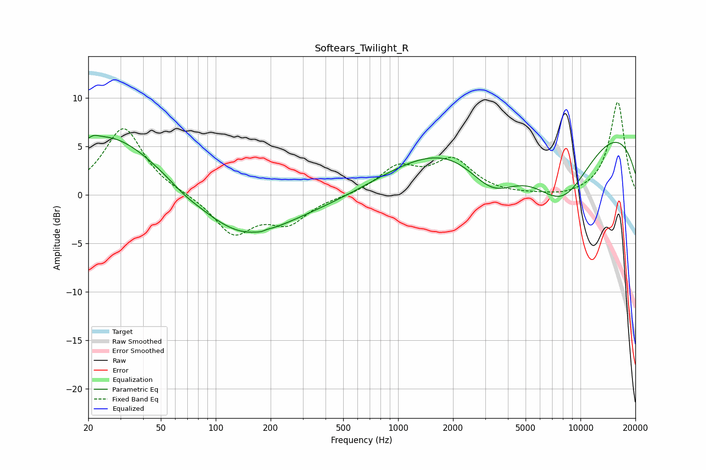

# Softears_Twilight_R
See [usage instructions](https://github.com/jaakkopasanen/AutoEq#usage) for more options and info.

### Parametric EQs
Apply preamp of -6.2 dB when using parametric equalizer.

|   # | Type    |   Fc (Hz) |    Q |   Gain (dB) |
|-----|---------|-----------|------|-------------|
|   1 | Peaking |        21 | 5.78 |         0.3 |
|   2 | Peaking |        26 | 0.5  |         6.4 |
|   3 | Peaking |        67 | 2.04 |        -0.3 |
|   4 | Peaking |       140 | 0.57 |        -4.5 |
|   5 | Peaking |       184 | 5.89 |        -0.6 |
|   6 | Peaking |       186 | 5.89 |         0.6 |
|   7 | Peaking |       424 | 0.55 |        -0.7 |
|   8 | Peaking |      3297 | 0.91 |        -5.7 |
|   9 | Peaking |      7099 | 0.18 |        12.7 |
|  10 | Peaking |      7871 | 0.58 |       -11.6 |

### Fixed Band EQs
When using fixed band (also called graphic) equalizer, apply preamp of **-9.6 dB** (if available) and set gains manually with these parameters.

|   # | Type    |   Fc (Hz) |    Q |   Gain (dB) |
|-----|---------|-----------|------|-------------|
|   1 | Peaking |        31 | 1.41 |         7   |
|   2 | Peaking |        62 | 1.41 |         0.1 |
|   3 | Peaking |       125 | 1.41 |        -3.9 |
|   4 | Peaking |       250 | 1.41 |        -2.7 |
|   5 | Peaking |       500 | 1.41 |        -0.1 |
|   6 | Peaking |      1000 | 1.41 |         2.7 |
|   7 | Peaking |      2000 | 1.41 |         3.4 |
|   8 | Peaking |      4000 | 1.41 |        -0.1 |
|   9 | Peaking |      8000 | 1.41 |        -0.3 |
|  10 | Peaking |     16000 | 1.41 |         9.6 |

### Graphs

