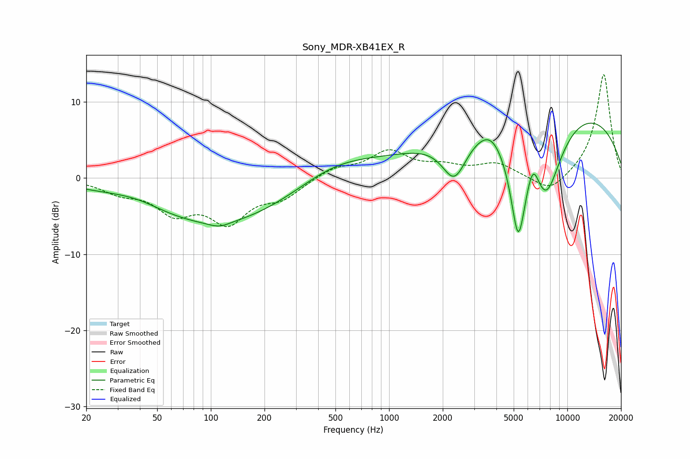

# Sony_MDR-XB41EX_R
See [usage instructions](https://github.com/jaakkopasanen/AutoEq#usage) for more options and info.

### Parametric EQs
Apply preamp of -7.3 dB when using parametric equalizer.

|   # | Type    |   Fc (Hz) |    Q |   Gain (dB) |
|-----|---------|-----------|------|-------------|
|   1 | Peaking |        38 | 0.86 |         1.4 |
|   2 | Peaking |       108 | 0.28 |        -6.4 |
|   3 | Peaking |       112 | 2.45 |        -0.6 |
|   4 | Peaking |       489 | 0.57 |         3.3 |
|   5 | Peaking |      2324 | 2.01 |        -5.7 |
|   6 | Peaking |      3739 | 1.92 |         1.6 |
|   7 | Peaking |      5303 | 2.83 |       -13.6 |
|   8 | Peaking |      6411 | 3.76 |         3.8 |
|   9 | Peaking |      7582 | 1.4  |       -10.6 |
|  10 | Peaking |      7934 | 0.21 |        10.3 |

### Fixed Band EQs
When using fixed band (also called graphic) equalizer, apply preamp of **-13.7 dB** (if available) and set gains manually with these parameters.

|   # | Type    |   Fc (Hz) |    Q |   Gain (dB) |
|-----|---------|-----------|------|-------------|
|   1 | Peaking |        31 | 1.41 |        -1.6 |
|   2 | Peaking |        62 | 1.41 |        -4   |
|   3 | Peaking |       125 | 1.41 |        -5.2 |
|   4 | Peaking |       250 | 1.41 |        -2.2 |
|   5 | Peaking |       500 | 1.41 |         1.3 |
|   6 | Peaking |      1000 | 1.41 |         3.3 |
|   7 | Peaking |      2000 | 1.41 |         1.2 |
|   8 | Peaking |      4000 | 1.41 |         1.8 |
|   9 | Peaking |      8000 | 1.41 |        -2.2 |
|  10 | Peaking |     16000 | 1.41 |        13.8 |

### Graphs

