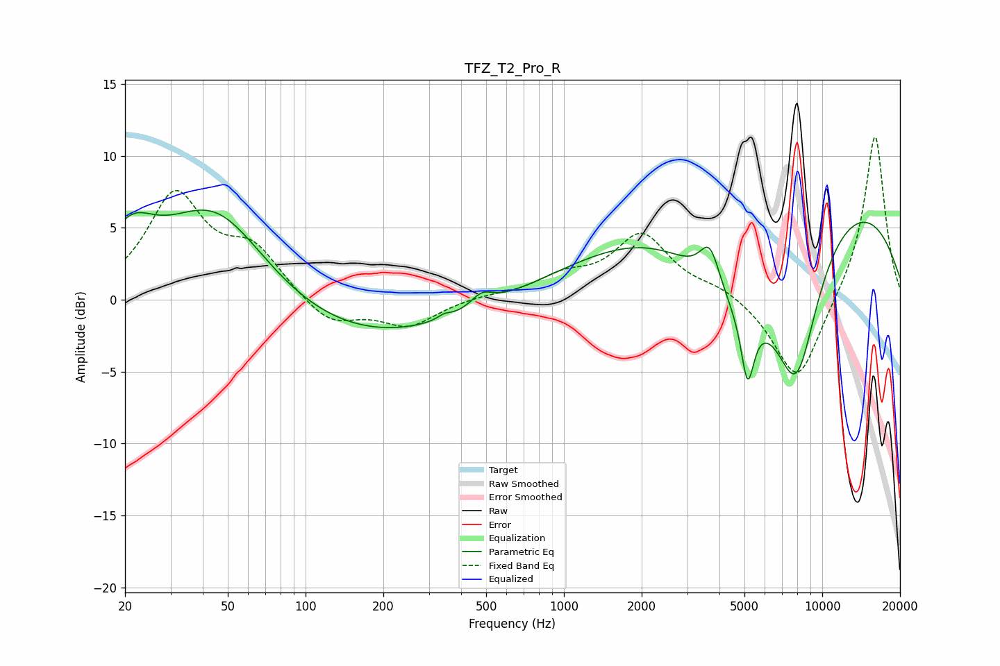

# TFZ_T2_Pro_R
See [usage instructions](https://github.com/jaakkopasanen/AutoEq#usage) for more options and info.

### Parametric EQs
Apply preamp of -6.3 dB when using parametric equalizer.

|   # | Type    |   Fc (Hz) |    Q |   Gain (dB) |
|-----|---------|-----------|------|-------------|
|   1 | Peaking |        21 | 1.58 |         3.2 |
|   2 | Peaking |        45 | 0.67 |         7.3 |
|   3 | Peaking |       143 | 0.32 |        -3.2 |
|   4 | Peaking |       344 | 5.93 |         0.3 |
|   5 | Peaking |       481 | 3.35 |         0.9 |
|   6 | Peaking |      3673 | 3.57 |         2.9 |
|   7 | Peaking |      4657 | 0.71 |        -7   |
|   8 | Peaking |      5141 | 5.56 |        -4.7 |
|   9 | Peaking |      6895 | 0.18 |         9.1 |
|  10 | Peaking |      7942 | 1.44 |       -10.3 |

### Fixed Band EQs
When using fixed band (also called graphic) equalizer, apply preamp of **-11.4 dB** (if available) and set gains manually with these parameters.

|   # | Type    |   Fc (Hz) |    Q |   Gain (dB) |
|-----|---------|-----------|------|-------------|
|   1 | Peaking |        31 | 1.41 |         7.1 |
|   2 | Peaking |        62 | 1.41 |         3.1 |
|   3 | Peaking |       125 | 1.41 |        -1.8 |
|   4 | Peaking |       250 | 1.41 |        -1.8 |
|   5 | Peaking |       500 | 1.41 |         0.2 |
|   6 | Peaking |      1000 | 1.41 |         1.3 |
|   7 | Peaking |      2000 | 1.41 |         4.4 |
|   8 | Peaking |      4000 | 1.41 |         0.8 |
|   9 | Peaking |      8000 | 1.41 |        -6   |
|  10 | Peaking |     16000 | 1.41 |        11.7 |

### Graphs

