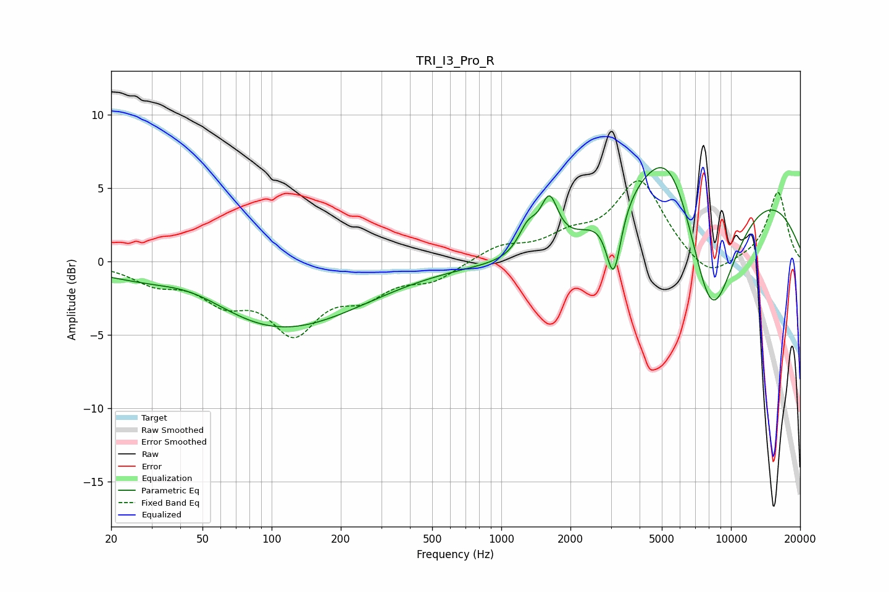

# TRI_I3_Pro_R
See [usage instructions](https://github.com/jaakkopasanen/AutoEq#usage) for more options and info.

### Parametric EQs
Apply preamp of -6.5 dB when using parametric equalizer.

|   # | Type    |   Fc (Hz) |    Q |   Gain (dB) |
|-----|---------|-----------|------|-------------|
|   1 | Peaking |        44 | 0.85 |         1.6 |
|   2 | Peaking |        66 | 0.94 |         0.4 |
|   3 | Peaking |        92 | 0.34 |        -5.1 |
|   4 | Peaking |      1305 | 3.33 |         1.8 |
|   5 | Peaking |      1620 | 3.65 |         3.4 |
|   6 | Peaking |      1844 | 0.59 |        -3.1 |
|   7 | Peaking |      3085 | 4.36 |        -4.8 |
|   8 | Peaking |      5465 | 1.16 |         5   |
|   9 | Peaking |      7295 | 0.26 |        10.1 |
|  10 | Peaking |      8186 | 0.9  |       -14.3 |

### Fixed Band EQs
When using fixed band (also called graphic) equalizer, apply preamp of **-5.6 dB** (if available) and set gains manually with these parameters.

|   # | Type    |   Fc (Hz) |    Q |   Gain (dB) |
|-----|---------|-----------|------|-------------|
|   1 | Peaking |        31 | 1.41 |        -1.2 |
|   2 | Peaking |        62 | 1.41 |        -2.2 |
|   3 | Peaking |       125 | 1.41 |        -4.4 |
|   4 | Peaking |       250 | 1.41 |        -1.9 |
|   5 | Peaking |       500 | 1.41 |        -1.2 |
|   6 | Peaking |      1000 | 1.41 |         1   |
|   7 | Peaking |      2000 | 1.41 |         1.4 |
|   8 | Peaking |      4000 | 1.41 |         5.4 |
|   9 | Peaking |      8000 | 1.41 |        -1.5 |
|  10 | Peaking |     16000 | 1.41 |         4.8 |

### Graphs

