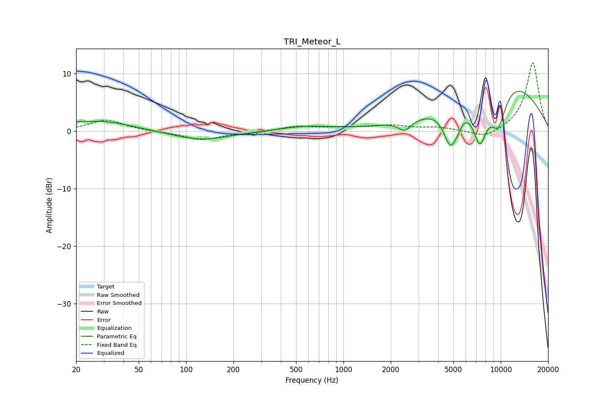

# TRI_Meteor_L
See [usage instructions](https://github.com/jaakkopasanen/AutoEq#usage) for more options and info.

### Parametric EQs
Apply preamp of -7.0 dB when using parametric equalizer.

|   # | Type    |   Fc (Hz) |    Q |   Gain (dB) |
|-----|---------|-----------|------|-------------|
|   1 | Peaking |        21 | 5.2  |         0.2 |
|   2 | Peaking |        28 | 0.73 |         1.8 |
|   3 | Peaking |       125 | 0.82 |        -1.6 |
|   4 | Peaking |       576 | 0.86 |         0.8 |
|   5 | Peaking |      2454 | 3.6  |        -1.8 |
|   6 | Peaking |      4788 | 3.29 |        -6.6 |
|   7 | Peaking |      5343 | 6    |        -1.1 |
|   8 | Peaking |      7375 | 2.81 |        -8.2 |
|   9 | Peaking |      9634 | 2.32 |        -7   |
|  10 | Peaking |     10000 | 0.39 |         9.7 |

### Fixed Band EQs
When using fixed band (also called graphic) equalizer, apply preamp of **-12.0 dB** (if available) and set gains manually with these parameters.

|   # | Type    |   Fc (Hz) |    Q |   Gain (dB) |
|-----|---------|-----------|------|-------------|
|   1 | Peaking |        31 | 1.41 |         2   |
|   2 | Peaking |        62 | 1.41 |        -0.1 |
|   3 | Peaking |       125 | 1.41 |        -1.5 |
|   4 | Peaking |       250 | 1.41 |        -0.3 |
|   5 | Peaking |       500 | 1.41 |         0.8 |
|   6 | Peaking |      1000 | 1.41 |         0.5 |
|   7 | Peaking |      2000 | 1.41 |         0.9 |
|   8 | Peaking |      4000 | 1.41 |         0.6 |
|   9 | Peaking |      8000 | 1.41 |        -1.4 |
|  10 | Peaking |     16000 | 1.41 |        12   |

### Graphs

