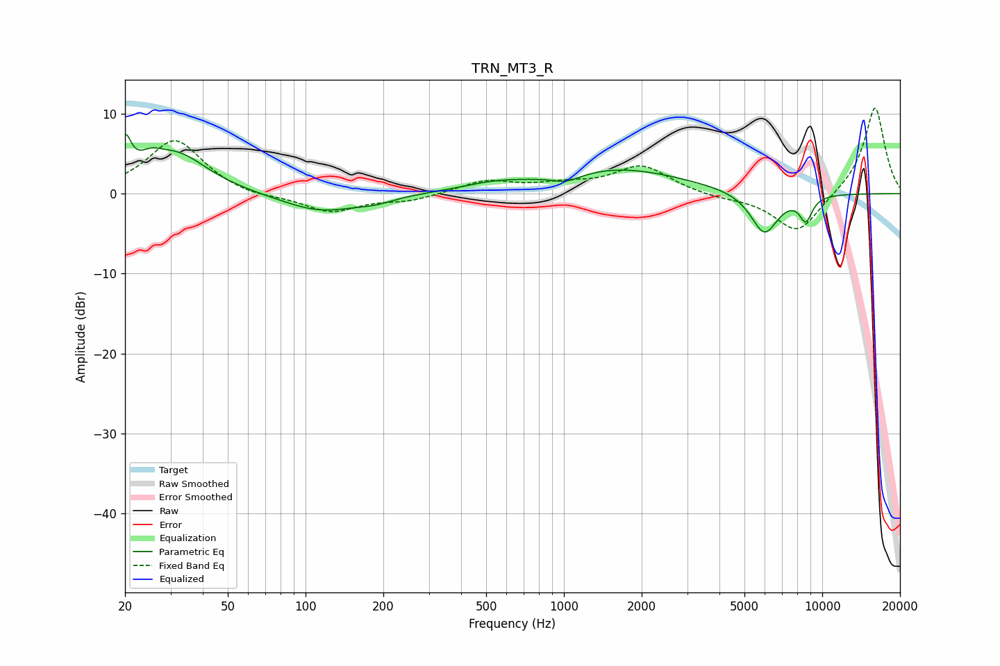

# TRN_MT3_R
See [usage instructions](https://github.com/jaakkopasanen/AutoEq#usage) for more options and info.

### Parametric EQs
Apply preamp of -7.5 dB when using parametric equalizer.

|   # | Type    |   Fc (Hz) |    Q |   Gain (dB) |
|-----|---------|-----------|------|-------------|
|   1 | Peaking |        20 | 6    |         4.8 |
|   2 | Peaking |        25 | 3.17 |         1.5 |
|   3 | Peaking |        32 | 1.16 |         4.8 |
|   4 | Peaking |       114 | 0.94 |        -2.3 |
|   5 | Peaking |       186 | 2.05 |        -0.6 |
|   6 | Peaking |       537 | 1.11 |         0.8 |
|   7 | Peaking |      1022 | 2.49 |        -1   |
|   8 | Peaking |      1633 | 0.55 |         3.1 |
|   9 | Peaking |      5972 | 2.55 |        -5.3 |
|  10 | Peaking |      8641 | 5.16 |        -3   |

### Fixed Band EQs
When using fixed band (also called graphic) equalizer, apply preamp of **-10.8 dB** (if available) and set gains manually with these parameters.

|   # | Type    |   Fc (Hz) |    Q |   Gain (dB) |
|-----|---------|-----------|------|-------------|
|   1 | Peaking |        31 | 1.41 |         6.8 |
|   2 | Peaking |        62 | 1.41 |        -0.6 |
|   3 | Peaking |       125 | 1.41 |        -2.3 |
|   4 | Peaking |       250 | 1.41 |        -0.9 |
|   5 | Peaking |       500 | 1.41 |         1.6 |
|   6 | Peaking |      1000 | 1.41 |         0.9 |
|   7 | Peaking |      2000 | 1.41 |         3.4 |
|   8 | Peaking |      4000 | 1.41 |        -0.5 |
|   9 | Peaking |      8000 | 1.41 |        -5.1 |
|  10 | Peaking |     16000 | 1.41 |        11   |

### Graphs

