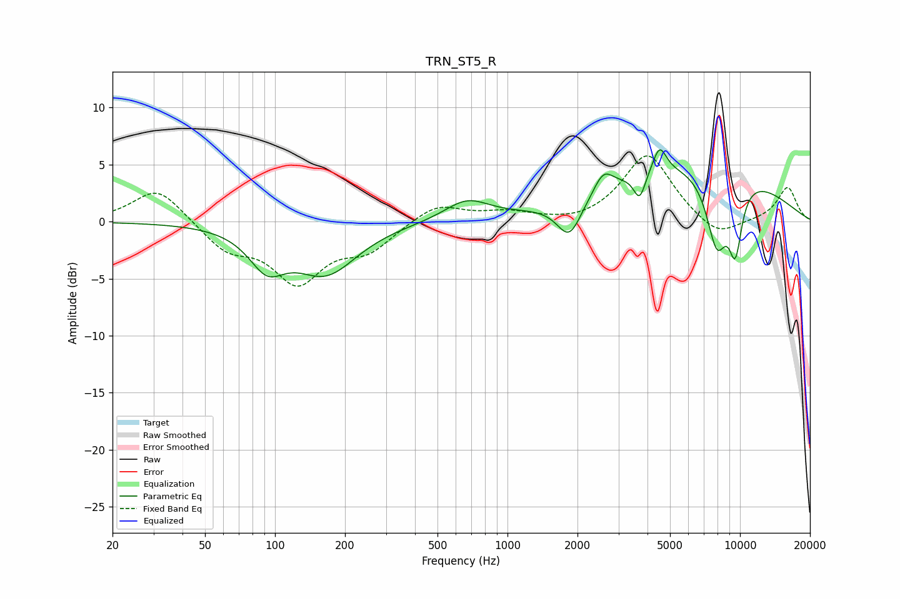

# TRN_ST5_R
See [usage instructions](https://github.com/jaakkopasanen/AutoEq#usage) for more options and info.

### Parametric EQs
Apply preamp of -6.4 dB when using parametric equalizer.

|   # | Type    |   Fc (Hz) |    Q |   Gain (dB) |
|-----|---------|-----------|------|-------------|
|   1 | Peaking |        92 | 1.85 |        -3.1 |
|   2 | Peaking |       166 | 1.04 |        -4.3 |
|   3 | Peaking |       669 | 1.47 |         1.8 |
|   4 | Peaking |      1845 | 2.67 |        -3.3 |
|   5 | Peaking |      2584 | 3.41 |         1.8 |
|   6 | Peaking |      3701 | 5.55 |        -2.3 |
|   7 | Peaking |      4508 | 4.79 |         2.3 |
|   8 | Peaking |      6549 | 0.36 |         5.3 |
|   9 | Peaking |      7951 | 2.79 |        -6.5 |
|  10 | Peaking |      9550 | 4.26 |        -5.6 |

### Fixed Band EQs
When using fixed band (also called graphic) equalizer, apply preamp of **-5.9 dB** (if available) and set gains manually with these parameters.

|   # | Type    |   Fc (Hz) |    Q |   Gain (dB) |
|-----|---------|-----------|------|-------------|
|   1 | Peaking |        31 | 1.41 |         3.1 |
|   2 | Peaking |        62 | 1.41 |        -2.3 |
|   3 | Peaking |       125 | 1.41 |        -5   |
|   4 | Peaking |       250 | 1.41 |        -2.2 |
|   5 | Peaking |       500 | 1.41 |         1.6 |
|   6 | Peaking |      1000 | 1.41 |         0.7 |
|   7 | Peaking |      2000 | 1.41 |        -0.3 |
|   8 | Peaking |      4000 | 1.41 |         6   |
|   9 | Peaking |      8000 | 1.41 |        -1.6 |
|  10 | Peaking |     16000 | 1.41 |         3   |

### Graphs

