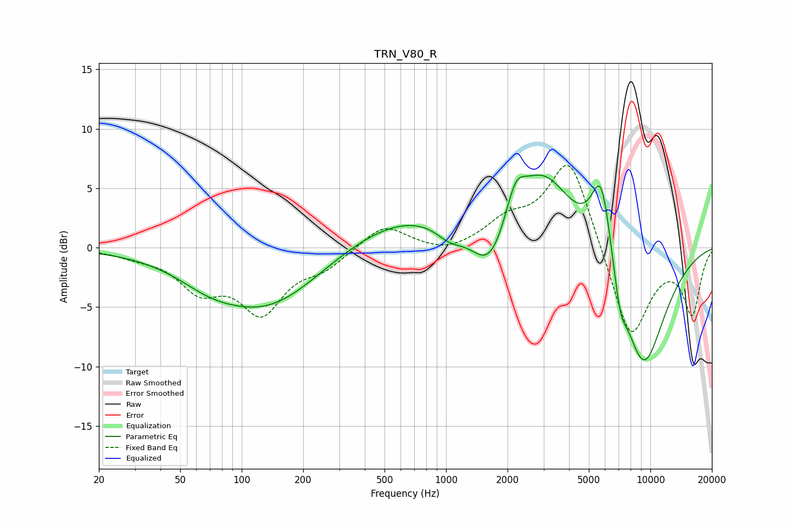

# TRN_V80_R
See [usage instructions](https://github.com/jaakkopasanen/AutoEq#usage) for more options and info.

### Parametric EQs
Apply preamp of -6.2 dB when using parametric equalizer.

|   # | Type    |   Fc (Hz) |    Q |   Gain (dB) |
|-----|---------|-----------|------|-------------|
|   1 | Peaking |        69 | 0.99 |        -1   |
|   2 | Peaking |       133 | 0.52 |        -5.1 |
|   3 | Peaking |       662 | 0.42 |         3   |
|   4 | Peaking |      1043 | 1.97 |        -1.3 |
|   5 | Peaking |      1639 | 1.53 |        -4.6 |
|   6 | Peaking |      2187 | 2.97 |         2.8 |
|   7 | Peaking |      2985 | 0.97 |         6.3 |
|   8 | Peaking |      5755 | 2.66 |         7.3 |
|   9 | Peaking |      7119 | 4.37 |        -2.5 |
|  10 | Peaking |      9211 | 1.09 |       -10.5 |

### Fixed Band EQs
When using fixed band (also called graphic) equalizer, apply preamp of **-7.0 dB** (if available) and set gains manually with these parameters.

|   # | Type    |   Fc (Hz) |    Q |   Gain (dB) |
|-----|---------|-----------|------|-------------|
|   1 | Peaking |        31 | 1.41 |        -0.5 |
|   2 | Peaking |        62 | 1.41 |        -3.1 |
|   3 | Peaking |       125 | 1.41 |        -5.1 |
|   4 | Peaking |       250 | 1.41 |        -1.4 |
|   5 | Peaking |       500 | 1.41 |         2   |
|   6 | Peaking |      1000 | 1.41 |        -0.6 |
|   7 | Peaking |      2000 | 1.41 |         1.9 |
|   8 | Peaking |      4000 | 1.41 |         7.8 |
|   9 | Peaking |      8000 | 1.41 |        -8   |
|  10 | Peaking |     16000 | 1.41 |        -5.4 |

### Graphs

