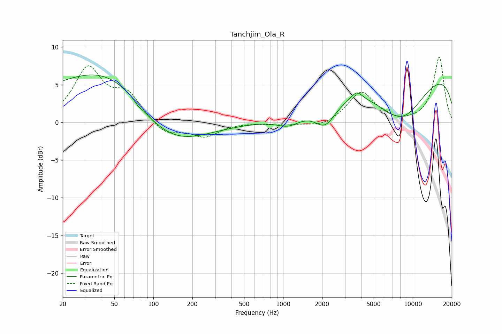

# Tanchjim_Ola_R
See [usage instructions](https://github.com/jaakkopasanen/AutoEq#usage) for more options and info.

### Parametric EQs
Apply preamp of -6.4 dB when using parametric equalizer.

|   # | Type    |   Fc (Hz) |    Q |   Gain (dB) |
|-----|---------|-----------|------|-------------|
|   1 | Peaking |        32 | 0.18 |         3.9 |
|   2 | Peaking |        47 | 0.45 |         3.9 |
|   3 | Peaking |        76 | 5.79 |        -0.3 |
|   4 | Peaking |        93 | 1.02 |        -0.9 |
|   5 | Peaking |       138 | 0.55 |        -5   |
|   6 | Peaking |      1099 | 1.54 |        -1.3 |
|   7 | Peaking |      2116 | 1.74 |        -3   |
|   8 | Peaking |      3700 | 3.39 |         1.1 |
|   9 | Peaking |      8170 | 0.65 |        -6.7 |
|  10 | Peaking |      9953 | 0.18 |         7.6 |

### Fixed Band EQs
When using fixed band (also called graphic) equalizer, apply preamp of **-8.7 dB** (if available) and set gains manually with these parameters.

|   # | Type    |   Fc (Hz) |    Q |   Gain (dB) |
|-----|---------|-----------|------|-------------|
|   1 | Peaking |        31 | 1.41 |         7   |
|   2 | Peaking |        62 | 1.41 |         3.4 |
|   3 | Peaking |       125 | 1.41 |        -1.7 |
|   4 | Peaking |       250 | 1.41 |        -1.8 |
|   5 | Peaking |       500 | 1.41 |         0   |
|   6 | Peaking |      1000 | 1.41 |        -0.3 |
|   7 | Peaking |      2000 | 1.41 |        -0.7 |
|   8 | Peaking |      4000 | 1.41 |         4.1 |
|   9 | Peaking |      8000 | 1.41 |        -0.2 |
|  10 | Peaking |     16000 | 1.41 |         8.7 |

### Graphs

