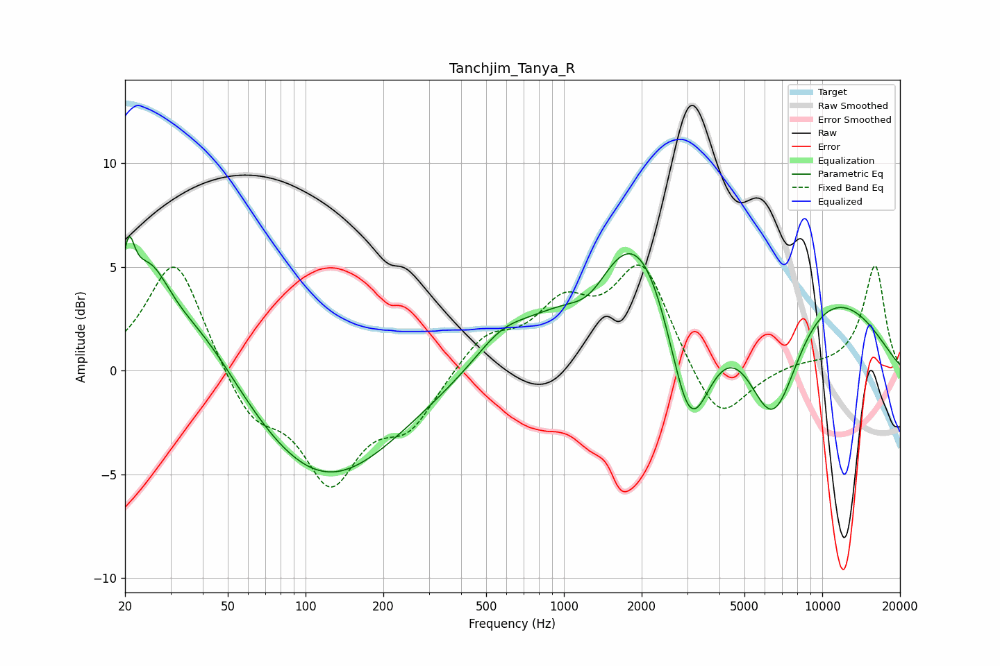

# Tanchjim_Tanya_R
See [usage instructions](https://github.com/jaakkopasanen/AutoEq#usage) for more options and info.

### Parametric EQs
Apply preamp of -6.6 dB when using parametric equalizer.

|   # | Type    |   Fc (Hz) |    Q |   Gain (dB) |
|-----|---------|-----------|------|-------------|
|   1 | Peaking |        21 | 5.93 |         3.2 |
|   2 | Peaking |        25 | 1.69 |         4   |
|   3 | Peaking |        40 | 0.87 |         2.7 |
|   4 | Peaking |       118 | 0.48 |        -5.5 |
|   5 | Peaking |       572 | 1.39 |         1.1 |
|   6 | Peaking |      1263 | 1.57 |        -1.8 |
|   7 | Peaking |      1962 | 0.88 |         4   |
|   8 | Peaking |      3067 | 1.41 |        -9.4 |
|   9 | Peaking |      4404 | 0.23 |         7.4 |
|  10 | Peaking |      6422 | 1.17 |        -7.9 |

### Fixed Band EQs
When using fixed band (also called graphic) equalizer, apply preamp of **-5.2 dB** (if available) and set gains manually with these parameters.

|   # | Type    |   Fc (Hz) |    Q |   Gain (dB) |
|-----|---------|-----------|------|-------------|
|   1 | Peaking |        31 | 1.41 |         5.6 |
|   2 | Peaking |        62 | 1.41 |        -2.3 |
|   3 | Peaking |       125 | 1.41 |        -5   |
|   4 | Peaking |       250 | 1.41 |        -2.4 |
|   5 | Peaking |       500 | 1.41 |         1.7 |
|   6 | Peaking |      1000 | 1.41 |         2.8 |
|   7 | Peaking |      2000 | 1.41 |         5   |
|   8 | Peaking |      4000 | 1.41 |        -2.8 |
|   9 | Peaking |      8000 | 1.41 |         0.3 |
|  10 | Peaking |     16000 | 1.41 |         5.1 |

### Graphs

