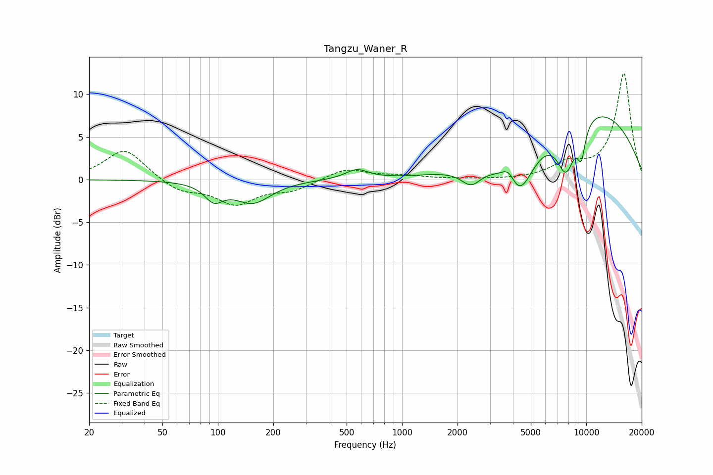

# Tangzu_Waner_R
See [usage instructions](https://github.com/jaakkopasanen/AutoEq#usage) for more options and info.

### Parametric EQs
Apply preamp of -7.4 dB when using parametric equalizer.

|   # | Type    |   Fc (Hz) |    Q |   Gain (dB) |
|-----|---------|-----------|------|-------------|
|   1 | Peaking |        95 | 2.82 |        -1.9 |
|   2 | Peaking |       155 | 1.43 |        -2.6 |
|   3 | Peaking |       567 | 2.28 |         1.1 |
|   4 | Peaking |      2371 | 2.61 |        -1.9 |
|   5 | Peaking |      3815 | 3.22 |         2.6 |
|   6 | Peaking |      4242 | 1.67 |        -6.9 |
|   7 | Peaking |      7768 | 2.54 |        -5.8 |
|   8 | Peaking |      9406 | 5.61 |        -3.8 |
|   9 | Peaking |      9415 | 5.63 |         0.2 |
|  10 | Peaking |     10000 | 0.33 |         8.6 |

### Fixed Band EQs
When using fixed band (also called graphic) equalizer, apply preamp of **-12.5 dB** (if available) and set gains manually with these parameters.

|   # | Type    |   Fc (Hz) |    Q |   Gain (dB) |
|-----|---------|-----------|------|-------------|
|   1 | Peaking |        31 | 1.41 |         3.6 |
|   2 | Peaking |        62 | 1.41 |        -1.4 |
|   3 | Peaking |       125 | 1.41 |        -2.7 |
|   4 | Peaking |       250 | 1.41 |        -1.1 |
|   5 | Peaking |       500 | 1.41 |         1.3 |
|   6 | Peaking |      1000 | 1.41 |         0.4 |
|   7 | Peaking |      2000 | 1.41 |         0   |
|   8 | Peaking |      4000 | 1.41 |        -0   |
|   9 | Peaking |      8000 | 1.41 |         1.6 |
|  10 | Peaking |     16000 | 1.41 |        12.4 |

### Graphs

