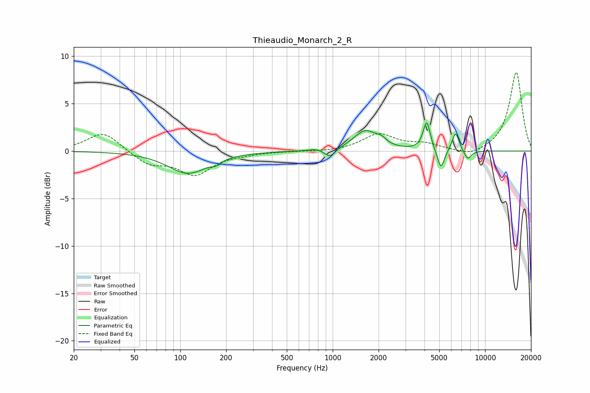

# Thieaudio_Monarch_2_R
See [usage instructions](https://github.com/jaakkopasanen/AutoEq#usage) for more options and info.

### Parametric EQs
Apply preamp of -3.1 dB when using parametric equalizer.

|   # | Type    |   Fc (Hz) |    Q |   Gain (dB) |
|-----|---------|-----------|------|-------------|
|   1 | Peaking |       112 | 1.09 |        -2.3 |
|   2 | Peaking |       172 | 4.84 |        -0.4 |
|   3 | Peaking |       773 | 3.85 |         0.2 |
|   4 | Peaking |       961 | 4.06 |        -0.9 |
|   5 | Peaking |      1641 | 1.81 |         2.1 |
|   6 | Peaking |      2091 | 4.6  |         0.5 |
|   7 | Peaking |      4139 | 6    |         3   |
|   8 | Peaking |      5127 | 6    |        -2.2 |
|   9 | Peaking |      6404 | 5.99 |         2   |
|  10 | Peaking |      7692 | 5.47 |        -1   |

### Fixed Band EQs
When using fixed band (also called graphic) equalizer, apply preamp of **-8.4 dB** (if available) and set gains manually with these parameters.

|   # | Type    |   Fc (Hz) |    Q |   Gain (dB) |
|-----|---------|-----------|------|-------------|
|   1 | Peaking |        31 | 1.41 |         2.1 |
|   2 | Peaking |        62 | 1.41 |        -1.4 |
|   3 | Peaking |       125 | 1.41 |        -2.4 |
|   4 | Peaking |       250 | 1.41 |        -0.2 |
|   5 | Peaking |       500 | 1.41 |        -0   |
|   6 | Peaking |      1000 | 1.41 |        -0.1 |
|   7 | Peaking |      2000 | 1.41 |         1.7 |
|   8 | Peaking |      4000 | 1.41 |         0.6 |
|   9 | Peaking |      8000 | 1.41 |        -0.6 |
|  10 | Peaking |     16000 | 1.41 |         8.4 |

### Graphs

