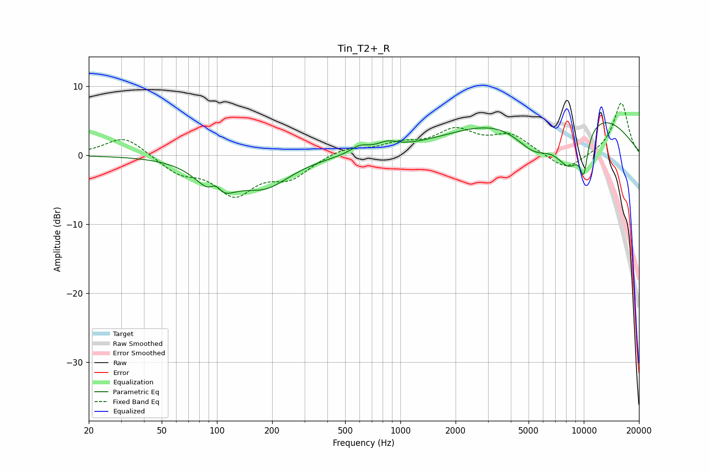

# Tin_T2+_R
See [usage instructions](https://github.com/jaakkopasanen/AutoEq#usage) for more options and info.

### Parametric EQs
Apply preamp of -4.8 dB when using parametric equalizer.

|   # | Type    |   Fc (Hz) |    Q |   Gain (dB) |
|-----|---------|-----------|------|-------------|
|   1 | Peaking |        98 | 4.65 |         2   |
|   2 | Peaking |        99 | 1.59 |        -5.1 |
|   3 | Peaking |       183 | 1    |        -4.1 |
|   4 | Peaking |       598 | 3.14 |         0.6 |
|   5 | Peaking |       609 | 2.15 |         0.5 |
|   6 | Peaking |       853 | 2.69 |         1   |
|   7 | Peaking |      5396 | 1.04 |        -7.4 |
|   8 | Peaking |      7095 | 0.35 |        11.8 |
|   9 | Peaking |      8361 | 1.37 |        -9.1 |
|  10 | Peaking |     10000 | 5.72 |        -5   |

### Fixed Band EQs
When using fixed band (also called graphic) equalizer, apply preamp of **-7.6 dB** (if available) and set gains manually with these parameters.

|   # | Type    |   Fc (Hz) |    Q |   Gain (dB) |
|-----|---------|-----------|------|-------------|
|   1 | Peaking |        31 | 1.41 |         2.9 |
|   2 | Peaking |        62 | 1.41 |        -2.3 |
|   3 | Peaking |       125 | 1.41 |        -5.3 |
|   4 | Peaking |       250 | 1.41 |        -2.9 |
|   5 | Peaking |       500 | 1.41 |         1.1 |
|   6 | Peaking |      1000 | 1.41 |         1.4 |
|   7 | Peaking |      2000 | 1.41 |         3.3 |
|   8 | Peaking |      4000 | 1.41 |         2.7 |
|   9 | Peaking |      8000 | 1.41 |        -2.4 |
|  10 | Peaking |     16000 | 1.41 |         7.7 |

### Graphs

