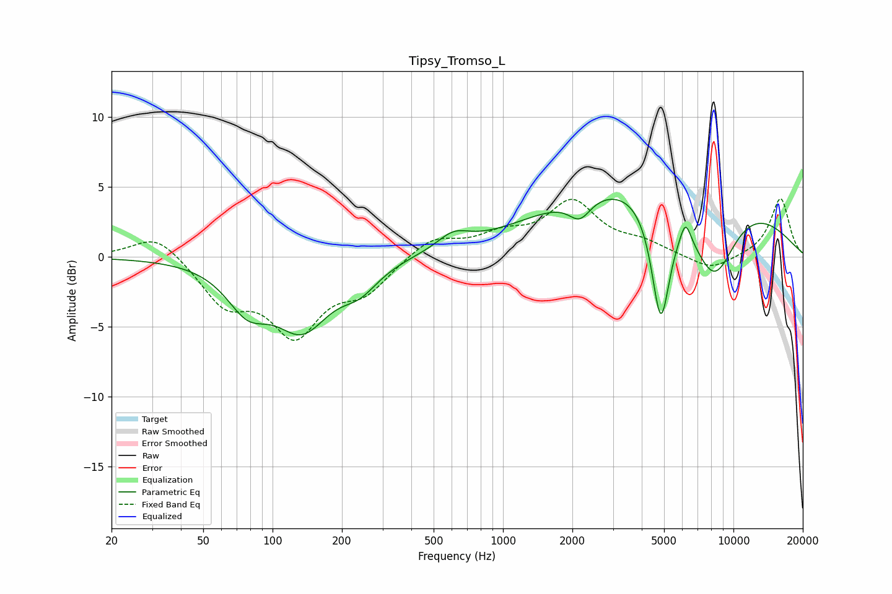

# Tipsy_Tromso_L
See [usage instructions](https://github.com/jaakkopasanen/AutoEq#usage) for more options and info.

### Parametric EQs
Apply preamp of -4.2 dB when using parametric equalizer.

|   # | Type    |   Fc (Hz) |    Q |   Gain (dB) |
|-----|---------|-----------|------|-------------|
|   1 | Peaking |        78 | 1.55 |        -2.9 |
|   2 | Peaking |       135 | 1.2  |        -4.6 |
|   3 | Peaking |       239 | 1.71 |        -1.6 |
|   4 | Peaking |       609 | 2.02 |         1.1 |
|   5 | Peaking |      2091 | 2.89 |         0   |
|   6 | Peaking |      2153 | 2.92 |        -1.6 |
|   7 | Peaking |      4838 | 3.39 |        -8.7 |
|   8 | Peaking |      5287 | 0.26 |         6.3 |
|   9 | Peaking |      6196 | 5.97 |         1.5 |
|  10 | Peaking |      8214 | 1.29 |        -6.4 |

### Fixed Band EQs
When using fixed band (also called graphic) equalizer, apply preamp of **-4.2 dB** (if available) and set gains manually with these parameters.

|   # | Type    |   Fc (Hz) |    Q |   Gain (dB) |
|-----|---------|-----------|------|-------------|
|   1 | Peaking |        31 | 1.41 |         1.8 |
|   2 | Peaking |        62 | 1.41 |        -3.1 |
|   3 | Peaking |       125 | 1.41 |        -5.1 |
|   4 | Peaking |       250 | 1.41 |        -2.2 |
|   5 | Peaking |       500 | 1.41 |         1.4 |
|   6 | Peaking |      1000 | 1.41 |         1.3 |
|   7 | Peaking |      2000 | 1.41 |         3.7 |
|   8 | Peaking |      4000 | 1.41 |         0.8 |
|   9 | Peaking |      8000 | 1.41 |        -1.1 |
|  10 | Peaking |     16000 | 1.41 |         4.2 |

### Graphs

