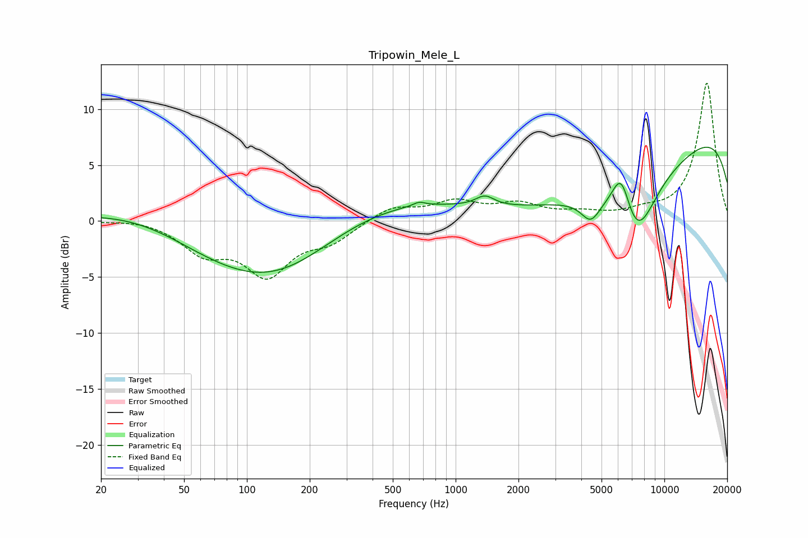

# Tripowin_Mele_L
See [usage instructions](https://github.com/jaakkopasanen/AutoEq#usage) for more options and info.

### Parametric EQs
Apply preamp of -6.7 dB when using parametric equalizer.

|   # | Type    |   Fc (Hz) |    Q |   Gain (dB) |
|-----|---------|-----------|------|-------------|
|   1 | Peaking |        66 | 0.48 |        -3.2 |
|   2 | Peaking |       134 | 0.18 |         5.3 |
|   3 | Peaking |       144 | 0.42 |        -7.7 |
|   4 | Peaking |       669 | 4.95 |         0.4 |
|   5 | Peaking |      1381 | 3.19 |         0.9 |
|   6 | Peaking |      4435 | 3.08 |        -1.9 |
|   7 | Peaking |      5809 | 0.28 |        -6.9 |
|   8 | Peaking |      6219 | 2.93 |         4.2 |
|   9 | Peaking |      7294 | 1.48 |        -5.6 |
|  10 | Peaking |      9768 | 0.18 |        11.1 |

### Fixed Band EQs
When using fixed band (also called graphic) equalizer, apply preamp of **-12.4 dB** (if available) and set gains manually with these parameters.

|   # | Type    |   Fc (Hz) |    Q |   Gain (dB) |
|-----|---------|-----------|------|-------------|
|   1 | Peaking |        31 | 1.41 |         0.3 |
|   2 | Peaking |        62 | 1.41 |        -2.6 |
|   3 | Peaking |       125 | 1.41 |        -4.5 |
|   4 | Peaking |       250 | 1.41 |        -1.6 |
|   5 | Peaking |       500 | 1.41 |         1.3 |
|   6 | Peaking |      1000 | 1.41 |         1.6 |
|   7 | Peaking |      2000 | 1.41 |         1.3 |
|   8 | Peaking |      4000 | 1.41 |         0.6 |
|   9 | Peaking |      8000 | 1.41 |         0.6 |
|  10 | Peaking |     16000 | 1.41 |        12.4 |

### Graphs

