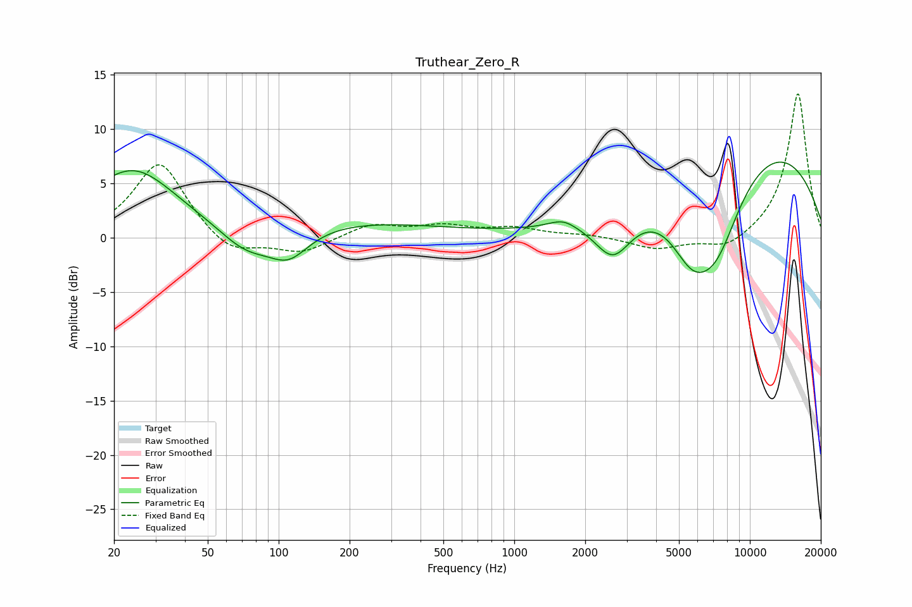

# Truthear_Zero_R
See [usage instructions](https://github.com/jaakkopasanen/AutoEq#usage) for more options and info.

### Parametric EQs
Apply preamp of -7.1 dB when using parametric equalizer.

|   # | Type    |   Fc (Hz) |    Q |   Gain (dB) |
|-----|---------|-----------|------|-------------|
|   1 | Peaking |        24 | 0.76 |         6.3 |
|   2 | Peaking |        27 | 5.83 |         0   |
|   3 | Peaking |        73 | 1.25 |        -2.3 |
|   4 | Peaking |       110 | 1.62 |        -2.7 |
|   5 | Peaking |       203 | 0.36 |         1.4 |
|   6 | Peaking |      1608 | 2.43 |         0.8 |
|   7 | Peaking |      2626 | 1.76 |        -4.1 |
|   8 | Peaking |      5647 | 1.48 |        -4.8 |
|   9 | Peaking |      7177 | 1.13 |        -7.9 |
|  10 | Peaking |      9930 | 0.28 |         9.3 |

### Fixed Band EQs
When using fixed band (also called graphic) equalizer, apply preamp of **-13.4 dB** (if available) and set gains manually with these parameters.

|   # | Type    |   Fc (Hz) |    Q |   Gain (dB) |
|-----|---------|-----------|------|-------------|
|   1 | Peaking |        31 | 1.41 |         7.1 |
|   2 | Peaking |        62 | 1.41 |        -1.8 |
|   3 | Peaking |       125 | 1.41 |        -1.4 |
|   4 | Peaking |       250 | 1.41 |         1.2 |
|   5 | Peaking |       500 | 1.41 |         1   |
|   6 | Peaking |      1000 | 1.41 |         0.8 |
|   7 | Peaking |      2000 | 1.41 |         0.3 |
|   8 | Peaking |      4000 | 1.41 |        -1.1 |
|   9 | Peaking |      8000 | 1.41 |        -1.2 |
|  10 | Peaking |     16000 | 1.41 |        13.4 |

### Graphs

