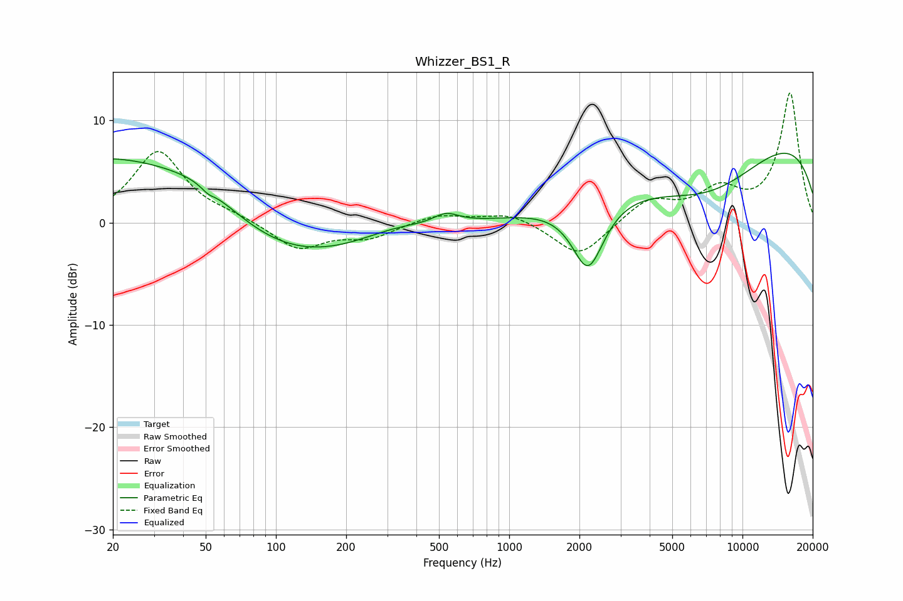

# Whizzer_BS1_R
See [usage instructions](https://github.com/jaakkopasanen/AutoEq#usage) for more options and info.

### Parametric EQs
Apply preamp of -6.9 dB when using parametric equalizer.

|   # | Type    |   Fc (Hz) |    Q |   Gain (dB) |
|-----|---------|-----------|------|-------------|
|   1 | Peaking |        22 | 0.29 |         6.9 |
|   2 | Peaking |        49 | 0.9  |         1.6 |
|   3 | Peaking |        50 | 4.68 |        -0.2 |
|   4 | Peaking |        52 | 5.98 |        -0.3 |
|   5 | Peaking |       100 | 0.41 |        -4.9 |
|   6 | Peaking |       320 | 1.01 |         0.8 |
|   7 | Peaking |       536 | 2.62 |         1   |
|   8 | Peaking |      2179 | 2.05 |        -6.8 |
|   9 | Peaking |      7148 | 0.48 |        -6.7 |
|  10 | Peaking |     10000 | 0.21 |        10.3 |

### Fixed Band EQs
When using fixed band (also called graphic) equalizer, apply preamp of **-12.8 dB** (if available) and set gains manually with these parameters.

|   # | Type    |   Fc (Hz) |    Q |   Gain (dB) |
|-----|---------|-----------|------|-------------|
|   1 | Peaking |        31 | 1.41 |         7   |
|   2 | Peaking |        62 | 1.41 |         0.5 |
|   3 | Peaking |       125 | 1.41 |        -2.6 |
|   4 | Peaking |       250 | 1.41 |        -1.4 |
|   5 | Peaking |       500 | 1.41 |         0.9 |
|   6 | Peaking |      1000 | 1.41 |         1   |
|   7 | Peaking |      2000 | 1.41 |        -3.5 |
|   8 | Peaking |      4000 | 1.41 |         2.2 |
|   9 | Peaking |      8000 | 1.41 |         2.8 |
|  10 | Peaking |     16000 | 1.41 |        12.6 |

### Graphs

