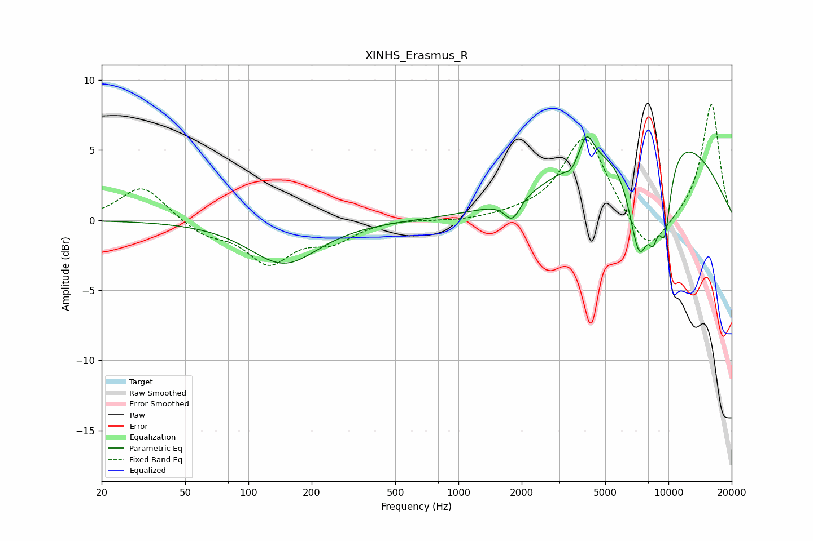

# XINHS_Erasmus_R
See [usage instructions](https://github.com/jaakkopasanen/AutoEq#usage) for more options and info.

### Parametric EQs
Apply preamp of -6.1 dB when using parametric equalizer.

|   # | Type    |   Fc (Hz) |    Q |   Gain (dB) |
|-----|---------|-----------|------|-------------|
|   1 | Peaking |       148 | 0.87 |        -3.1 |
|   2 | Peaking |      1803 | 3.84 |        -1.5 |
|   3 | Peaking |      1896 | 4.53 |        -0.1 |
|   4 | Peaking |      3440 | 5.5  |        -0.6 |
|   5 | Peaking |      4081 | 4.26 |         2   |
|   6 | Peaking |      7269 | 2.4  |        -8   |
|   7 | Peaking |      8415 | 0.34 |         7   |
|   8 | Peaking |      8464 | 5.56 |        -2.6 |
|   9 | Peaking |      9557 | 3.84 |        -4.8 |
|  10 | Peaking |      9711 | 5.98 |        -0.7 |

### Fixed Band EQs
When using fixed band (also called graphic) equalizer, apply preamp of **-8.4 dB** (if available) and set gains manually with these parameters.

|   # | Type    |   Fc (Hz) |    Q |   Gain (dB) |
|-----|---------|-----------|------|-------------|
|   1 | Peaking |        31 | 1.41 |         2.5 |
|   2 | Peaking |        62 | 1.41 |        -1   |
|   3 | Peaking |       125 | 1.41 |        -2.9 |
|   4 | Peaking |       250 | 1.41 |        -1.3 |
|   5 | Peaking |       500 | 1.41 |         0.1 |
|   6 | Peaking |      1000 | 1.41 |        -0.1 |
|   7 | Peaking |      2000 | 1.41 |         0.2 |
|   8 | Peaking |      4000 | 1.41 |         6.1 |
|   9 | Peaking |      8000 | 1.41 |        -2.9 |
|  10 | Peaking |     16000 | 1.41 |         8.4 |

### Graphs

