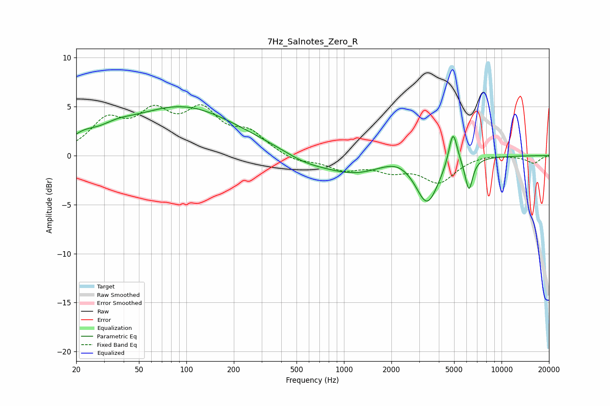

# 7Hz_Salnotes_Zero_R
See [usage instructions](https://github.com/jaakkopasanen/AutoEq#usage) for more options and info.

### Parametric EQs
Apply preamp of -5.1 dB when using parametric equalizer.

|   # | Type    |   Fc (Hz) |    Q |   Gain (dB) |
|-----|---------|-----------|------|-------------|
|   1 | Peaking |        22 | 1.86 |         0.9 |
|   2 | Peaking |        36 | 1.28 |         0.9 |
|   3 | Peaking |        94 | 0.42 |         4.8 |
|   4 | Peaking |       327 | 0.61 |         0.3 |
|   5 | Peaking |       566 | 0.96 |        -0.9 |
|   6 | Peaking |      1149 | 0.77 |        -1.7 |
|   7 | Peaking |      2181 | 1.52 |         0.7 |
|   8 | Peaking |      3372 | 1.96 |        -4.7 |
|   9 | Peaking |      4918 | 5.14 |         3.7 |
|  10 | Peaking |      6208 | 5.77 |        -3.2 |

### Fixed Band EQs
When using fixed band (also called graphic) equalizer, apply preamp of **-5.3 dB** (if available) and set gains manually with these parameters.

|   # | Type    |   Fc (Hz) |    Q |   Gain (dB) |
|-----|---------|-----------|------|-------------|
|   1 | Peaking |        31 | 1.41 |         3.2 |
|   2 | Peaking |        62 | 1.41 |         3.7 |
|   3 | Peaking |       125 | 1.41 |         4   |
|   4 | Peaking |       250 | 1.41 |         2   |
|   5 | Peaking |       500 | 1.41 |        -0.7 |
|   6 | Peaking |      1000 | 1.41 |        -1.3 |
|   7 | Peaking |      2000 | 1.41 |        -1.3 |
|   8 | Peaking |      4000 | 1.41 |        -2.6 |
|   9 | Peaking |      8000 | 1.41 |         0.2 |
|  10 | Peaking |     16000 | 1.41 |        -0.8 |

### Graphs

