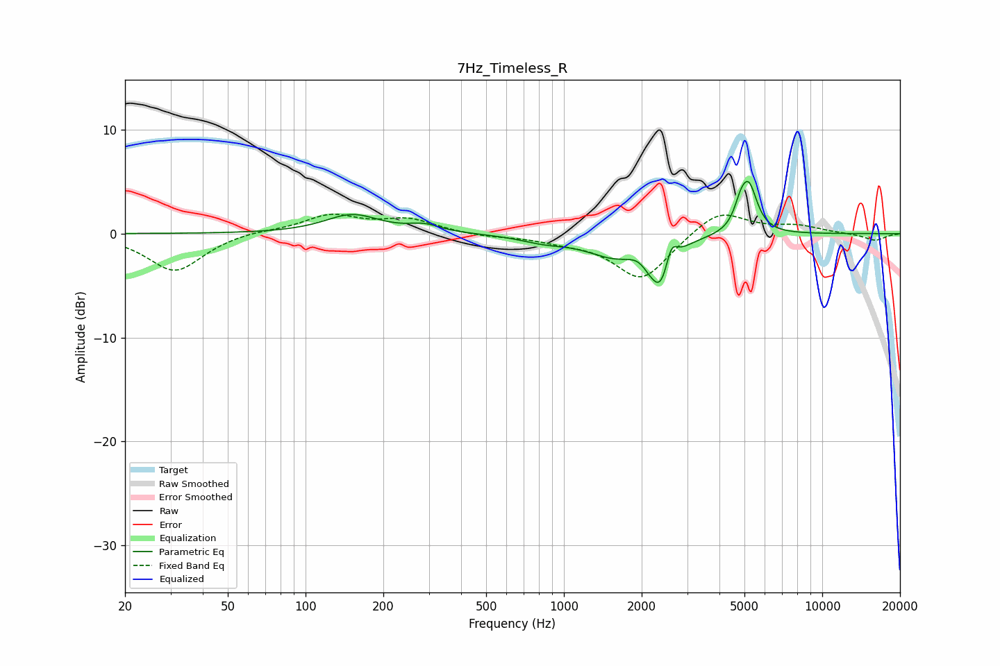

# 7Hz_Timeless_R
See [usage instructions](https://github.com/jaakkopasanen/AutoEq#usage) for more options and info.

### Parametric EQs
Apply preamp of -5.1 dB when using parametric equalizer.

|   # | Type    |   Fc (Hz) |    Q |   Gain (dB) |
|-----|---------|-----------|------|-------------|
|   1 | Peaking |       152 | 1.35 |         1.8 |
|   2 | Peaking |       288 | 2.34 |         0.7 |
|   3 | Peaking |       838 | 1.54 |        -0.6 |
|   4 | Peaking |      1573 | 1.27 |        -2   |
|   5 | Peaking |      1996 | 3.34 |         0.7 |
|   6 | Peaking |      2106 | 4.66 |        -0.6 |
|   7 | Peaking |      2386 | 3.21 |        -4.9 |
|   8 | Peaking |      2596 | 6    |         2.7 |
|   9 | Peaking |      4824 | 5.92 |         1.5 |
|  10 | Peaking |      5198 | 4.3  |         4.4 |

### Fixed Band EQs
When using fixed band (also called graphic) equalizer, apply preamp of **-2.0 dB** (if available) and set gains manually with these parameters.

|   # | Type    |   Fc (Hz) |    Q |   Gain (dB) |
|-----|---------|-----------|------|-------------|
|   1 | Peaking |        31 | 1.41 |        -3.6 |
|   2 | Peaking |        62 | 1.41 |         0.3 |
|   3 | Peaking |       125 | 1.41 |         1.7 |
|   4 | Peaking |       250 | 1.41 |         1.3 |
|   5 | Peaking |       500 | 1.41 |        -0.3 |
|   6 | Peaking |      1000 | 1.41 |        -0.5 |
|   7 | Peaking |      2000 | 1.41 |        -4.5 |
|   8 | Peaking |      4000 | 1.41 |         2.4 |
|   9 | Peaking |      8000 | 1.41 |         0.7 |
|  10 | Peaking |     16000 | 1.41 |        -0.7 |

### Graphs

