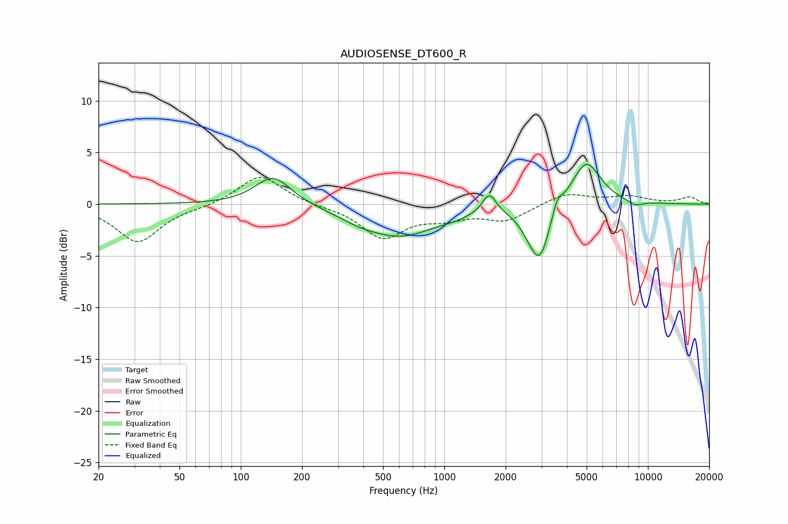

# AUDIOSENSE_DT600_R
See [usage instructions](https://github.com/jaakkopasanen/AutoEq#usage) for more options and info.

### Parametric EQs
Apply preamp of -3.9 dB when using parametric equalizer.

|   # | Type    |   Fc (Hz) |    Q |   Gain (dB) |
|-----|---------|-----------|------|-------------|
|   1 | Peaking |       144 | 1.59 |         2.8 |
|   2 | Peaking |       375 | 1.45 |        -0.5 |
|   3 | Peaking |       606 | 0.77 |        -3   |
|   4 | Peaking |      1131 | 2.05 |        -0.3 |
|   5 | Peaking |      1663 | 4.27 |         1.9 |
|   6 | Peaking |      2633 | 2.62 |        -1.3 |
|   7 | Peaking |      2958 | 2.95 |        -4.7 |
|   8 | Peaking |      3589 | 6    |         1.2 |
|   9 | Peaking |      4973 | 1.95 |         4.3 |
|  10 | Peaking |      8664 | 3.61 |        -0.5 |

### Fixed Band EQs
When using fixed band (also called graphic) equalizer, apply preamp of **-2.7 dB** (if available) and set gains manually with these parameters.

|   # | Type    |   Fc (Hz) |    Q |   Gain (dB) |
|-----|---------|-----------|------|-------------|
|   1 | Peaking |        31 | 1.41 |        -3.7 |
|   2 | Peaking |        62 | 1.41 |        -0.2 |
|   3 | Peaking |       125 | 1.41 |         2.9 |
|   4 | Peaking |       250 | 1.41 |        -0.1 |
|   5 | Peaking |       500 | 1.41 |        -3.2 |
|   6 | Peaking |      1000 | 1.41 |        -1.1 |
|   7 | Peaking |      2000 | 1.41 |        -1.5 |
|   8 | Peaking |      4000 | 1.41 |         1.1 |
|   9 | Peaking |      8000 | 1.41 |         0.7 |
|  10 | Peaking |     16000 | 1.41 |         0.7 |

### Graphs

