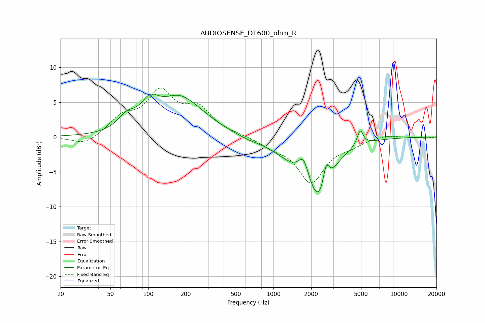

# AUDIOSENSE_DT600_ohm_R
See [usage instructions](https://github.com/jaakkopasanen/AutoEq#usage) for more options and info.

### Parametric EQs
Apply preamp of -6.3 dB when using parametric equalizer.

|   # | Type    |   Fc (Hz) |    Q |   Gain (dB) |
|-----|---------|-----------|------|-------------|
|   1 | Peaking |        67 | 2.05 |         1.8 |
|   2 | Peaking |       103 | 1.98 |         2.9 |
|   3 | Peaking |       188 | 0.83 |         6.1 |
|   4 | Peaking |       211 | 1.41 |        -0.7 |
|   5 | Peaking |       634 | 1.49 |        -0.3 |
|   6 | Peaking |      1458 | 0.9  |        -2.3 |
|   7 | Peaking |      1737 | 3.49 |         2.9 |
|   8 | Peaking |      2326 | 1.51 |        -8.2 |
|   9 | Peaking |      2632 | 5.47 |         3.5 |
|  10 | Peaking |      4925 | 6    |         2.2 |

### Fixed Band EQs
When using fixed band (also called graphic) equalizer, apply preamp of **-7.1 dB** (if available) and set gains manually with these parameters.

|   # | Type    |   Fc (Hz) |    Q |   Gain (dB) |
|-----|---------|-----------|------|-------------|
|   1 | Peaking |        31 | 1.41 |        -1.3 |
|   2 | Peaking |        62 | 1.41 |         2.5 |
|   3 | Peaking |       125 | 1.41 |         6   |
|   4 | Peaking |       250 | 1.41 |         3.7 |
|   5 | Peaking |       500 | 1.41 |         0.2 |
|   6 | Peaking |      1000 | 1.41 |        -1.1 |
|   7 | Peaking |      2000 | 1.41 |        -6.3 |
|   8 | Peaking |      4000 | 1.41 |        -0.9 |
|   9 | Peaking |      8000 | 1.41 |         0.4 |
|  10 | Peaking |     16000 | 1.41 |        -0.2 |

### Graphs

