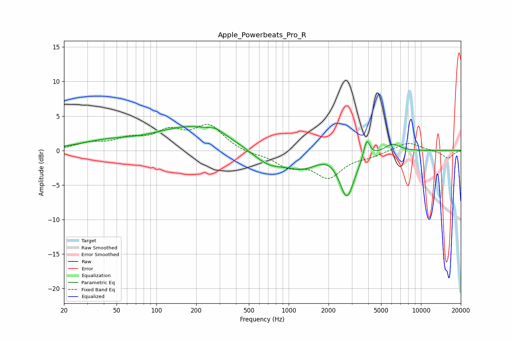

# Apple_Powerbeats_Pro_R
See [usage instructions](https://github.com/jaakkopasanen/AutoEq#usage) for more options and info.

### Parametric EQs
Apply preamp of -3.6 dB when using parametric equalizer.

|   # | Type    |   Fc (Hz) |    Q |   Gain (dB) |
|-----|---------|-----------|------|-------------|
|   1 | Peaking |        41 | 0.7  |         1.1 |
|   2 | Peaking |       189 | 0.5  |         3.4 |
|   3 | Peaking |       283 | 2.87 |         0.6 |
|   4 | Peaking |       555 | 1.36 |        -0.4 |
|   5 | Peaking |       719 | 1.33 |        -1.6 |
|   6 | Peaking |      1296 | 0.98 |        -2.6 |
|   7 | Peaking |      2020 | 1.24 |         1.2 |
|   8 | Peaking |      2750 | 2.42 |        -6.7 |
|   9 | Peaking |      3892 | 6    |         2.8 |
|  10 | Peaking |      6070 | 2.35 |         1.2 |

### Fixed Band EQs
When using fixed band (also called graphic) equalizer, apply preamp of **-3.9 dB** (if available) and set gains manually with these parameters.

|   # | Type    |   Fc (Hz) |    Q |   Gain (dB) |
|-----|---------|-----------|------|-------------|
|   1 | Peaking |        31 | 1.41 |         0.9 |
|   2 | Peaking |        62 | 1.41 |         1.4 |
|   3 | Peaking |       125 | 1.41 |         2.4 |
|   4 | Peaking |       250 | 1.41 |         3.4 |
|   5 | Peaking |       500 | 1.41 |        -0.5 |
|   6 | Peaking |      1000 | 1.41 |        -2.1 |
|   7 | Peaking |      2000 | 1.41 |        -3.6 |
|   8 | Peaking |      4000 | 1.41 |        -0.7 |
|   9 | Peaking |      8000 | 1.41 |         1.3 |
|  10 | Peaking |     16000 | 1.41 |        -1.1 |

### Graphs

