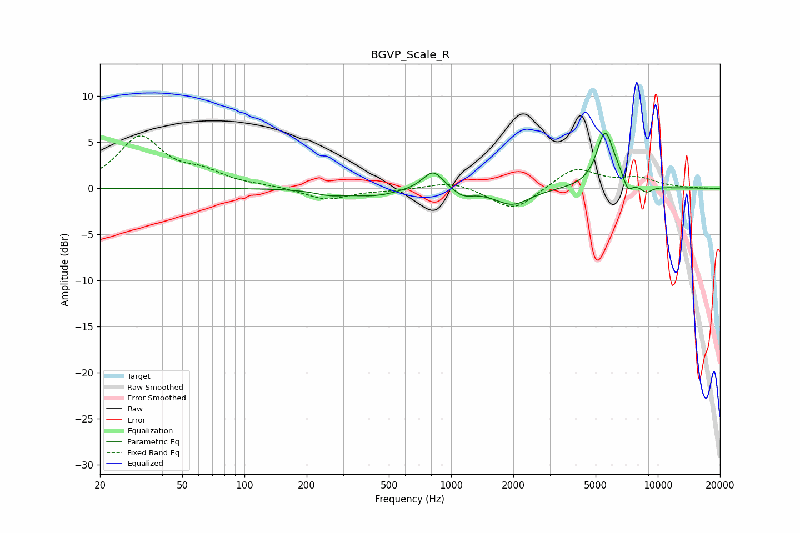

# BGVP_Scale_R
See [usage instructions](https://github.com/jaakkopasanen/AutoEq#usage) for more options and info.

### Parametric EQs
Apply preamp of -6.1 dB when using parametric equalizer.

|   # | Type    |   Fc (Hz) |    Q |   Gain (dB) |
|-----|---------|-----------|------|-------------|
|   1 | Peaking |       260 | 1.93 |        -0.5 |
|   2 | Peaking |       423 | 1.25 |        -0.8 |
|   3 | Peaking |       812 | 2.06 |         0.4 |
|   4 | Peaking |       819 | 3.05 |         1.7 |
|   5 | Peaking |      1138 | 2.98 |        -0.8 |
|   6 | Peaking |      1977 | 1.67 |        -1.8 |
|   7 | Peaking |      5544 | 3.42 |         5.7 |
|   8 | Peaking |      6295 | 2.75 |         0.8 |
|   9 | Peaking |      7156 | 6    |        -1.4 |
|  10 | Peaking |      8790 | 4.42 |        -0.7 |

### Fixed Band EQs
When using fixed band (also called graphic) equalizer, apply preamp of **-5.8 dB** (if available) and set gains manually with these parameters.

|   # | Type    |   Fc (Hz) |    Q |   Gain (dB) |
|-----|---------|-----------|------|-------------|
|   1 | Peaking |        31 | 1.41 |         5.4 |
|   2 | Peaking |        62 | 1.41 |         1.4 |
|   3 | Peaking |       125 | 1.41 |         0.2 |
|   4 | Peaking |       250 | 1.41 |        -1.3 |
|   5 | Peaking |       500 | 1.41 |        -0.2 |
|   6 | Peaking |      1000 | 1.41 |         0.8 |
|   7 | Peaking |      2000 | 1.41 |        -2.5 |
|   8 | Peaking |      4000 | 1.41 |         2.3 |
|   9 | Peaking |      8000 | 1.41 |         1   |
|  10 | Peaking |     16000 | 1.41 |        -0   |

### Graphs

