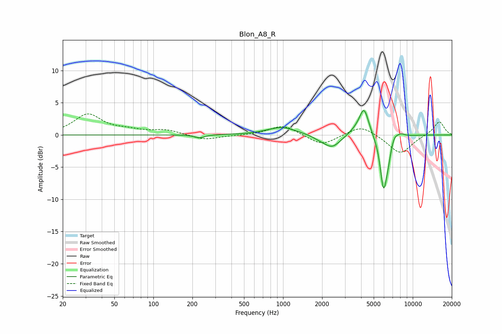

# Blon_A8_R
See [usage instructions](https://github.com/jaakkopasanen/AutoEq#usage) for more options and info.

### Parametric EQs
Apply preamp of -3.9 dB when using parametric equalizer.

|   # | Type    |   Fc (Hz) |    Q |   Gain (dB) |
|-----|---------|-----------|------|-------------|
|   1 | Peaking |       227 | 3.79 |        -0.5 |
|   2 | Peaking |       977 | 1.28 |         1.2 |
|   3 | Peaking |      1891 | 2.8  |        -0.3 |
|   4 | Peaking |      2385 | 2.16 |        -2   |
|   5 | Peaking |      3613 | 2.64 |         0.6 |
|   6 | Peaking |      4213 | 3.83 |         4.2 |
|   7 | Peaking |      5951 | 5.14 |        -8   |
|   8 | Peaking |      6428 | 5.99 |        -1.8 |
|   9 | Peaking |      7225 | 6    |         0.8 |
|  10 | Peaking |      8038 | 4.23 |         0.6 |

### Fixed Band EQs
When using fixed band (also called graphic) equalizer, apply preamp of **-3.4 dB** (if available) and set gains manually with these parameters.

|   # | Type    |   Fc (Hz) |    Q |   Gain (dB) |
|-----|---------|-----------|------|-------------|
|   1 | Peaking |        31 | 1.41 |         3.1 |
|   2 | Peaking |        62 | 1.41 |         0.6 |
|   3 | Peaking |       125 | 1.41 |         0.7 |
|   4 | Peaking |       250 | 1.41 |        -0.8 |
|   5 | Peaking |       500 | 1.41 |        -0.1 |
|   6 | Peaking |      1000 | 1.41 |         1.6 |
|   7 | Peaking |      2000 | 1.41 |        -1.7 |
|   8 | Peaking |      4000 | 1.41 |         1.6 |
|   9 | Peaking |      8000 | 1.41 |        -3   |
|  10 | Peaking |     16000 | 1.41 |         2.1 |

### Graphs

