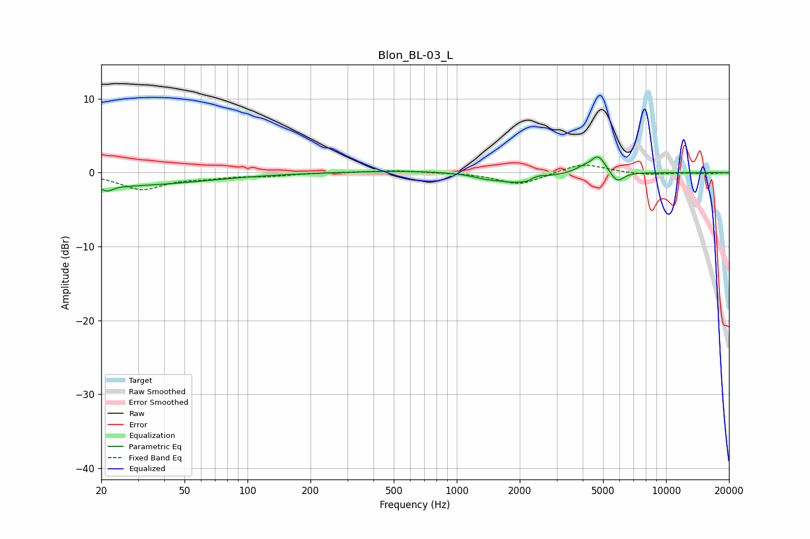

# Blon_BL-03_L
See [usage instructions](https://github.com/jaakkopasanen/AutoEq#usage) for more options and info.

### Parametric EQs
Apply preamp of -2.2 dB when using parametric equalizer.

|   # | Type    |   Fc (Hz) |    Q |   Gain (dB) |
|-----|---------|-----------|------|-------------|
|   1 | Peaking |        20 | 0.29 |        -1.8 |
|   2 | Peaking |        21 | 5.8  |        -0.7 |
|   3 | Peaking |       565 | 0.64 |         0.3 |
|   4 | Peaking |      1360 | 2.62 |        -0.4 |
|   5 | Peaking |      1960 | 1.36 |        -1.4 |
|   6 | Peaking |      2211 | 5.99 |        -0.2 |
|   7 | Peaking |      2419 | 4.04 |         0.5 |
|   8 | Peaking |      4012 | 3.47 |         0.6 |
|   9 | Peaking |      4746 | 3.86 |         2.3 |
|  10 | Peaking |      5834 | 4.32 |        -1.5 |

### Fixed Band EQs
When using fixed band (also called graphic) equalizer, apply preamp of **-1.1 dB** (if available) and set gains manually with these parameters.

|   # | Type    |   Fc (Hz) |    Q |   Gain (dB) |
|-----|---------|-----------|------|-------------|
|   1 | Peaking |        31 | 1.41 |        -2.2 |
|   2 | Peaking |        62 | 1.41 |        -0.5 |
|   3 | Peaking |       125 | 1.41 |        -0.4 |
|   4 | Peaking |       250 | 1.41 |         0.1 |
|   5 | Peaking |       500 | 1.41 |         0.3 |
|   6 | Peaking |      1000 | 1.41 |         0   |
|   7 | Peaking |      2000 | 1.41 |        -1.7 |
|   8 | Peaking |      4000 | 1.41 |         1.3 |
|   9 | Peaking |      8000 | 1.41 |        -0.3 |
|  10 | Peaking |     16000 | 1.41 |        -0.1 |

### Graphs

