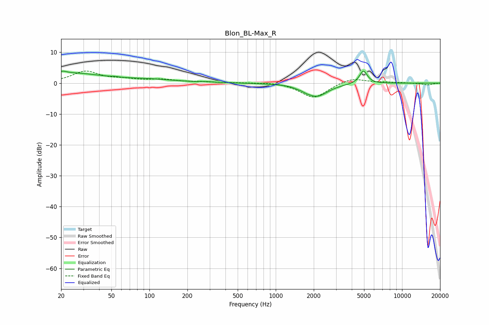

# Blon_BL-Max_R
See [usage instructions](https://github.com/jaakkopasanen/AutoEq#usage) for more options and info.

### Parametric EQs
Apply preamp of -4.0 dB when using parametric equalizer.

|   # | Type    |   Fc (Hz) |    Q |   Gain (dB) |
|-----|---------|-----------|------|-------------|
|   1 | Peaking |        21 | 4.7  |         0.8 |
|   2 | Peaking |        24 | 0.58 |         3.1 |
|   3 | Peaking |        53 | 5.97 |         0.2 |
|   4 | Peaking |       101 | 0.67 |         1   |
|   5 | Peaking |       286 | 3.63 |         0.2 |
|   6 | Peaking |       398 | 6    |         0.1 |
|   7 | Peaking |      1485 | 5.98 |        -0.2 |
|   8 | Peaking |      1731 | 5.14 |        -0.4 |
|   9 | Peaking |      2107 | 1.64 |        -4.3 |
|  10 | Peaking |      4942 | 4.5  |         4.3 |

### Fixed Band EQs
When using fixed band (also called graphic) equalizer, apply preamp of **-4.0 dB** (if available) and set gains manually with these parameters.

|   # | Type    |   Fc (Hz) |    Q |   Gain (dB) |
|-----|---------|-----------|------|-------------|
|   1 | Peaking |        31 | 1.41 |         3.7 |
|   2 | Peaking |        62 | 1.41 |         1   |
|   3 | Peaking |       125 | 1.41 |         1   |
|   4 | Peaking |       250 | 1.41 |         0.3 |
|   5 | Peaking |       500 | 1.41 |         0.1 |
|   6 | Peaking |      1000 | 1.41 |         0.4 |
|   7 | Peaking |      2000 | 1.41 |        -4.9 |
|   8 | Peaking |      4000 | 1.41 |         1.9 |
|   9 | Peaking |      8000 | 1.41 |         0.3 |
|  10 | Peaking |     16000 | 1.41 |        -0.6 |

### Graphs

