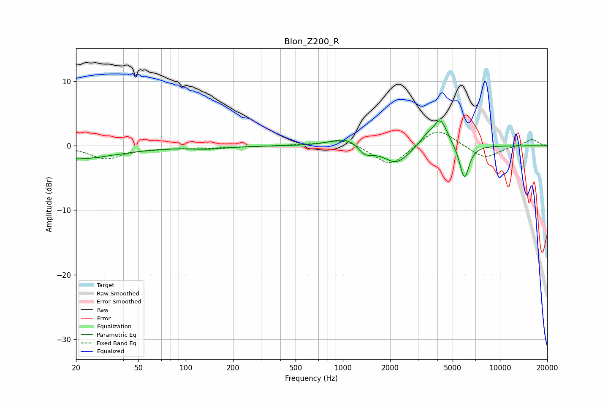

# Blon_Z200_R
See [usage instructions](https://github.com/jaakkopasanen/AutoEq#usage) for more options and info.

### Parametric EQs
Apply preamp of -4.0 dB when using parametric equalizer.

|   # | Type    |   Fc (Hz) |    Q |   Gain (dB) |
|-----|---------|-----------|------|-------------|
|   1 | Peaking |        20 | 0.56 |        -2   |
|   2 | Peaking |       137 | 1.21 |        -0.4 |
|   3 | Peaking |      1016 | 1.54 |         1.2 |
|   4 | Peaking |      1150 | 2.4  |         0.3 |
|   5 | Peaking |      1374 | 3.27 |        -1.3 |
|   6 | Peaking |      1561 | 1.94 |        -0.4 |
|   7 | Peaking |      2191 | 1.84 |        -2.7 |
|   8 | Peaking |      3405 | 3.3  |         1.1 |
|   9 | Peaking |      4172 | 3    |         4.2 |
|  10 | Peaking |      5938 | 4.48 |        -5.4 |

### Fixed Band EQs
When using fixed band (also called graphic) equalizer, apply preamp of **-2.2 dB** (if available) and set gains manually with these parameters.

|   # | Type    |   Fc (Hz) |    Q |   Gain (dB) |
|-----|---------|-----------|------|-------------|
|   1 | Peaking |        31 | 1.41 |        -2   |
|   2 | Peaking |        62 | 1.41 |        -0.3 |
|   3 | Peaking |       125 | 1.41 |        -0.3 |
|   4 | Peaking |       250 | 1.41 |        -0.1 |
|   5 | Peaking |       500 | 1.41 |         0.1 |
|   6 | Peaking |      1000 | 1.41 |         1.2 |
|   7 | Peaking |      2000 | 1.41 |        -3.3 |
|   8 | Peaking |      4000 | 1.41 |         2.9 |
|   9 | Peaking |      8000 | 1.41 |        -2   |
|  10 | Peaking |     16000 | 1.41 |         1   |

### Graphs

