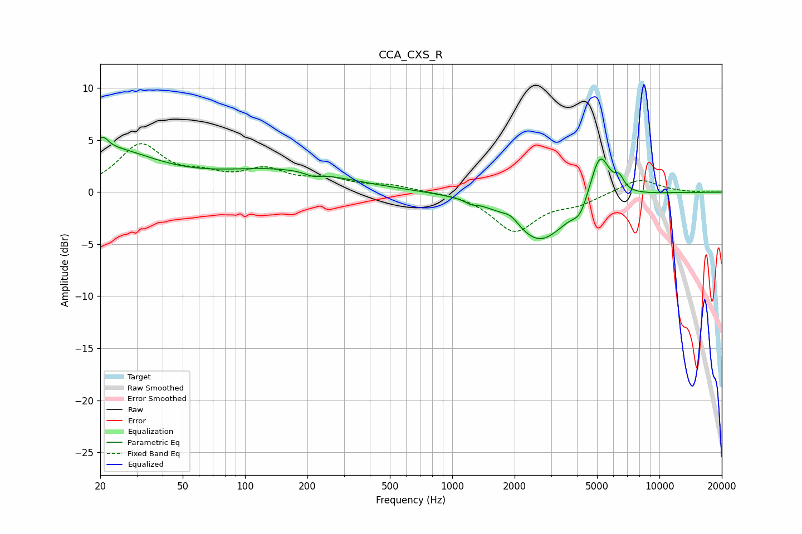

# CCA_CXS_R
See [usage instructions](https://github.com/jaakkopasanen/AutoEq#usage) for more options and info.

### Parametric EQs
Apply preamp of -5.4 dB when using parametric equalizer.

|   # | Type    |   Fc (Hz) |    Q |   Gain (dB) |
|-----|---------|-----------|------|-------------|
|   1 | Peaking |        21 | 5.25 |         1.2 |
|   2 | Peaking |        21 | 0.61 |         3.9 |
|   3 | Peaking |       147 | 0.46 |         2   |
|   4 | Peaking |       212 | 3.81 |        -0.4 |
|   5 | Peaking |      1228 | 5.94 |        -0.3 |
|   6 | Peaking |      1920 | 3.41 |         0.8 |
|   7 | Peaking |      2636 | 1.05 |        -4.8 |
|   8 | Peaking |      4140 | 4.11 |        -1.3 |
|   9 | Peaking |      5161 | 2.97 |         4.6 |
|  10 | Peaking |      6404 | 6    |         1.1 |

### Fixed Band EQs
When using fixed band (also called graphic) equalizer, apply preamp of **-4.7 dB** (if available) and set gains manually with these parameters.

|   # | Type    |   Fc (Hz) |    Q |   Gain (dB) |
|-----|---------|-----------|------|-------------|
|   1 | Peaking |        31 | 1.41 |         4.4 |
|   2 | Peaking |        62 | 1.41 |         1.2 |
|   3 | Peaking |       125 | 1.41 |         1.9 |
|   4 | Peaking |       250 | 1.41 |         1   |
|   5 | Peaking |       500 | 1.41 |         0.6 |
|   6 | Peaking |      1000 | 1.41 |         0   |
|   7 | Peaking |      2000 | 1.41 |        -3.7 |
|   8 | Peaking |      4000 | 1.41 |        -0.9 |
|   9 | Peaking |      8000 | 1.41 |         1.3 |
|  10 | Peaking |     16000 | 1.41 |        -0   |

### Graphs

