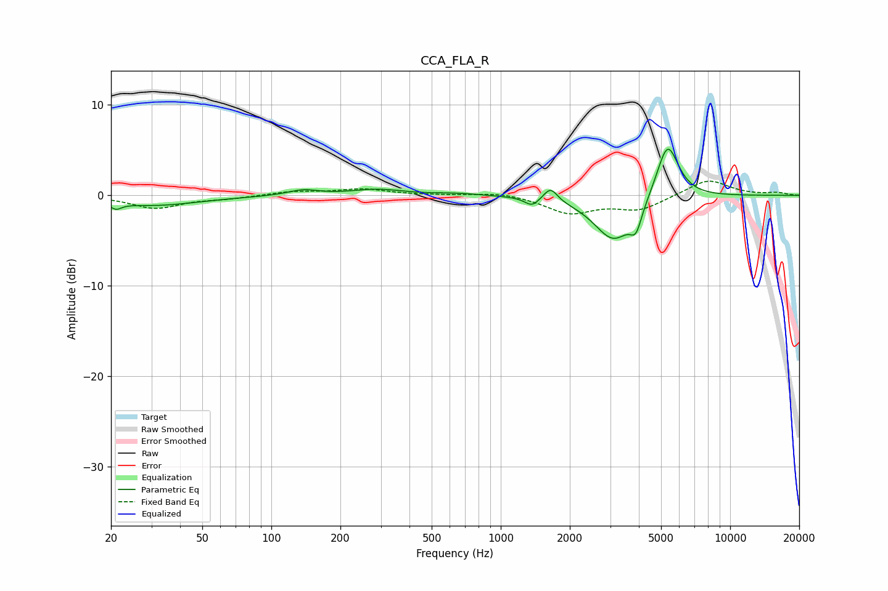

# CCA_FLA_R
See [usage instructions](https://github.com/jaakkopasanen/AutoEq#usage) for more options and info.

### Parametric EQs
Apply preamp of -5.2 dB when using parametric equalizer.

|   # | Type    |   Fc (Hz) |    Q |   Gain (dB) |
|-----|---------|-----------|------|-------------|
|   1 | Peaking |        21 | 5.95 |        -0.7 |
|   2 | Peaking |        30 | 0.69 |        -1.1 |
|   3 | Peaking |       137 | 2.15 |         0.6 |
|   4 | Peaking |       289 | 1.27 |         0.7 |
|   5 | Peaking |       651 | 1.45 |         0.2 |
|   6 | Peaking |      1369 | 4.68 |        -0.9 |
|   7 | Peaking |      1648 | 4.76 |         1.5 |
|   8 | Peaking |      3108 | 1.64 |        -5   |
|   9 | Peaking |      3888 | 5.52 |        -2.4 |
|  10 | Peaking |      5334 | 2.87 |         6.3 |

### Fixed Band EQs
When using fixed band (also called graphic) equalizer, apply preamp of **-1.7 dB** (if available) and set gains manually with these parameters.

|   # | Type    |   Fc (Hz) |    Q |   Gain (dB) |
|-----|---------|-----------|------|-------------|
|   1 | Peaking |        31 | 1.41 |        -1.4 |
|   2 | Peaking |        62 | 1.41 |        -0.3 |
|   3 | Peaking |       125 | 1.41 |         0.4 |
|   4 | Peaking |       250 | 1.41 |         0.7 |
|   5 | Peaking |       500 | 1.41 |         0   |
|   6 | Peaking |      1000 | 1.41 |         0.4 |
|   7 | Peaking |      2000 | 1.41 |        -1.9 |
|   8 | Peaking |      4000 | 1.41 |        -1.5 |
|   9 | Peaking |      8000 | 1.41 |         1.8 |
|  10 | Peaking |     16000 | 1.41 |         0.3 |

### Graphs

